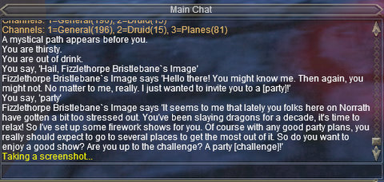
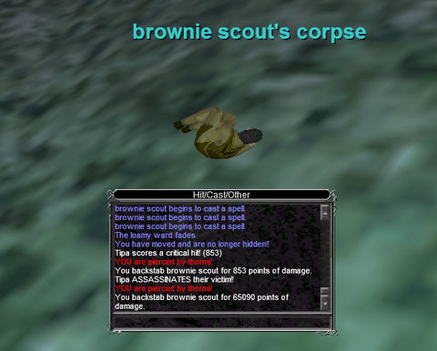

# The 9000 players of EverQuest

*Posted by Tipa on 2010-03-30 07:00:17*

OpenEdge1 has for awhile been estimating the number of subscribers to a game based on the number of its players who report their usage with XFire. [His latest calculations](http://simple-n-complex.blogspot.com/2010/03/xfire-game.html) put Star Trek Online at 117K players, which more or less jibes with Cryptic's reports. I'm dubious about the other standings. His formula would give WoW 6.3 million players in the West, which I believe would be a real high water mark for them. Of oft-repeated 11.5 million players, the majority were in Asia, and unlikely to be XFire users.

EverQuest I and II didn't come out so well. OpenEdge1's formula gives EQ2 a bare 35K subscriptions, and EQ1 only 9K players spread out over all their servers. I can say from personal experience that EverQuest is far busier than that. It's more likely that the sorts of people who play the EverQuests use XFire less than the sorts of people who play WoW and EVE Online. I'm an aberration -- I play all of them!

[caption id="attachment\_4903" align="aligncenter" width="480" caption="Bristlebane\\'s Quest"][/caption]

April 1st comes Thursday. April Fools day in the USA is Bristlebane's Day in Norrath. The Image of Bristlebane already prowls the Plane of Knowledge in EverQuest, handing out quests to run around the world finding rare things and bringing them back. Modern EQ quests offer a wide variety of rewards. You can often ignore rewards for which you have no use and choose to get money or just raw experience instead. Bristlebane's quest has a vast variety of possible rewards, including special fireworks and experience potions. I've been swigging experience potions like water flasks since my return to the game.

You won't find me on EverQuest on Bristlebane's Day, though. I'll be in EQ2, doing their ONE DAY ONLY events. It'll be a nice break from working on my epic quest in EQ.
[caption id="attachment\_4904" align="aligncenter" width="480" caption="I assassinate harmless woodland creatures!"][/caption]

Last night was spent relaxing in EQ; aside from a single monster mission (that dinged me to 79), I spent it working on my epic baking skills.

I have always hated EverQuest's crafting; it's just so useless and arbitrary, but it's also REQUIRED for the rogue epic 1.5. So I spent a good portion of the night on fairly pointless tasks like slaughtering lava basilisks in Lavastorm for their eggs, with which I could make dough, with which I could make pie crust which I could put in a pie tin but I had to make that pie tin first! So off to the forge and pottery wheel for those after hunting down the ingredients all through PoK. Finally get all the ingredients together and make batwing pies (yum?) until trivial. Then sell all of them because they take up space and the Fish Rolls I made earlier in this baking madness are better food. Then off to Lesser Faydark to camp brownies for their parts.

Back to PoK to make White Chocolate from them as an ingredient in Birthday Cakes. But oops, don't have a Cake Round, have to go smith up one of those and.... sigh. This is all just skilling up baking. The actual foods I have to make will require rare ingredients gathered from all over Norrath.

After baking comes brewing, the halfling skill that I could skip if I wanted. It sounds a lot easier than baking, though, so why skip it? I'll save that for later. I'd LIKE to skip smithing and tailoring; those sound like real chores.

Very much waiting for the parts of my epic where I can kill things....

