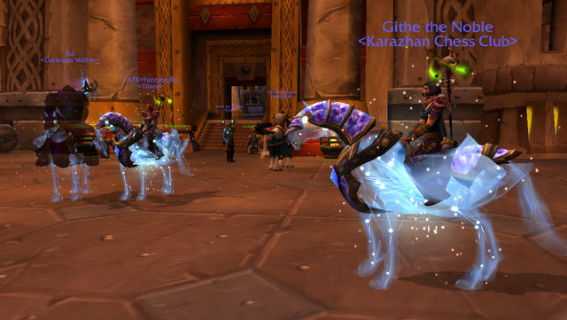
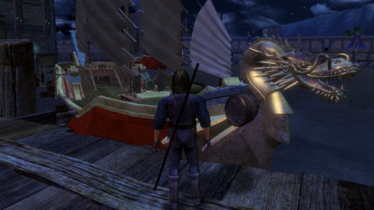
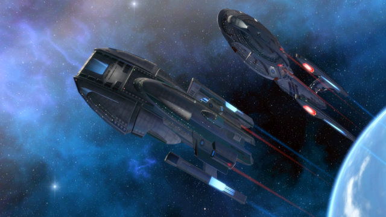
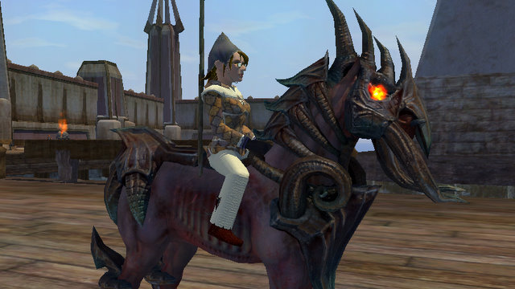

# Quick Shots... WoW, Vanguard, STO, EQ2

I logged into Ironforge and pressed the screenshot button. Didn't move, didn't turn. Three sparkly ponies! Suddenly my epic mechanostrider seemed rare and unusual.

Vanguard may be the only game I have ever played that lets you make such elaborate ships. I believe Ultima Online let you make them, and I know Darkfall lets you, and of course Pirates of the Burning Sea and Florensia have ship building as a big part of game play, but does any other game let you launch your ship and then walk away, leaving it docked in the world?

Folks on Twitter were saying the new Nimbus-class Deep Space Science Vessel in Star Trek Online looked a lot like the Battlestar Galactica. My fingers tripped over themselves logging in to see. This weekend is a discount weekend in STO so I was able to afford the new DSV skin; I had to sell some trash loot to afford the base ship in game. I told my bridge crew to get the hell out of their bunks and report to the new ship and we took it out for a spin in Earth orbit. Very nice. Then Longasc came by and we all transferred back to the USS Monterey, a recon science vessel, because, who flies a DSV?

Anyone seen a sparkle pony? My nightmare HELL HORSE is feeling a little peckish.

