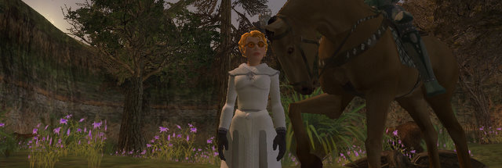

# EQ2's new Passport "5 for 3" plan.

*Posted by Tipa on 2010-04-22 06:36:38*

Yeah, I know I'm late on this, but... [EQ2's Passport program](http://eq2players.station.sony.com/_views/get_the_game/passport.vm)? $5/month for three consecutive days of play per month? Absolute genius.

To recap what the plan offers:

> **Weekend Warrior**

Your game, your time and your money. You choose when to play! This is your chance to continue to play the game you love, with all your friends and most importantly, when you want!

**Party Crasher**

With the EQII Passport, your alt accounts or inactive accounts will not have to miss another seasonal event or special game update. Visit Norrath to participate in fun-filled events and festivities at a discount.

**Item Hoarder Galore**

You do not have to miss another login bonus or promotional "claim" special again! Just because your account is inactive doesn't mean your collection of goodies will suffer.

**Penny Pinching Multiboxers**

Running several subscriptions might be a bit expensive these days, but not with this program! Fire up your alt accounts for a weekend raid or even a Battlegrounds match all by yourself!

**Commitment Issues?**

The EQII Passport program is available for a period of three (3) consecutive days per 30-day period. To continue playing after three days, you must convert to a standard EQII monthly subscription plan.

**Vets Only, No Newbs Allowed!**

This subscription option is only available for inactive or closed accounts. Visiting Norrath has never been so simple or economical. This is the most convenient option available for casual accounts.

If World of Warcraft offered this, I'd be all over it. If Lord of the Rings offered this, I would absolutely take it. If Champions Online did this, I'd be spending weekends in Millennium City. But since I can't maintain a subscription to all these games, I don't play them.

Now, EQ2 is one of my main games, and I have access to it, EverQuest and Vanguard (and SWG and Pirates of the Burning Sea) as part of the Station Pass. That gives me access to all SOE's games for a flat rate. THAT was a subscription innovation we expected to see other multi-MMO developers such as NCsoft, Turbine and Cryptic copy, but it hasn't happened.

Now, clearly SOE expects that three days will be too few, and you'll want to convert to a regular subscription so you can continue playing on the FOURTH day. What's wrong with that? Nothing's wrong with that. The "Passport" program gives EQ2 three days a month to convince you to upgrade to a full subscription, and failing that, at least it has the chance to get more people on the servers. MMOs live and die on having lots of people online at the same time, after all.

It's a great idea. Maybe this time the rest of the MMO developers will figure out that SOE's got something worth copying and get with the program. 

I particularly like how they encourage alt accounts. Can't afford the subscription fees for a second or third account? Put them on the plan and then just haul them out once a month for some serious farming or whatever. Including farming battlegrounds, apparently :P

So, Blizzard... Where's my Passport to Azeroth?

