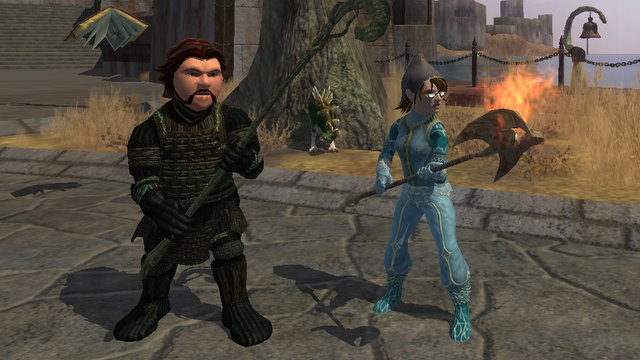

# Levels: What are they good for?

*Posted by Tipa on 2010-04-25 14:15:55*

IcyWiz on Twitter shared her Beckett Magazine EQ2 code for a Ssraezha Observer's Staff. I happily toko it and redeemed it on my EQ2 account, only then remembering my only casters on that account were island babies -- characters I kept on the island for harvesting and crafting reasons and well, there was no reason to take them on. I spent a few hours this weekend leveling one of them, Tsuki, to 20, so she could wield the staff (it being an appearance slot item). The Timorous Deep newbie zone was its same old reliable experience machine and it didn't take me more than maybe three hours to get through it. This weekend being a bonus experience weekend helped, too.

Tsuki was 22 when she finished all the quests in TD. Progressing further would involve hooking up to other experience treadmills until she ran out of levels at 90, at which point there is little to do but do it all over again.

Levels are funny things. What they really are is permission to use some content. You can go to the store and buy EQ2's Sentinel's Fate and install all the content in the game onto your hard drive, but just buying it does not give you permission to use it. That permission can only be gained by doing repetitious tasks.

John Archibald Wheeler, the famous physicist, once said that "time is nature's way of keeping everything from happening at once." Levels are time, and levels are keeping you from doing everything all at once. Take away levels, and an MMO would become "Hello, new recruit! Here's your sword and there's the dragon. Have at it! Well done! Game over!"

That's what we've all come to accept, anyway.

Wouldn't it make more sense to have experience mean just that -- the player's own experience dealing with unusual game situations? As players go through the game and gain more abilities and better gear, they bring more options to a situation, but otherwise, what's to stop Bilbo from crawling into Smaug's lair and playing riddles with a dragon? If Sam were the great elf warrior as the orcs in Cirith Ungol thought he was, instead of the hobbit with a magic sword and a glass phial filled with holy light he really was, the end might have been the same (Frodo rescued; orcs dead) but the means would have been different.

We'd have to set some ground rules in a no-levels world.

First, have monsters choose from a wide pool of abilities and behaviors, at least semi-randomly.

Second, accept the no-win scenario. There will be encounters that will be easily defeated and perhaps others that will have some combination of abilities that make it impossible to manage (unless, perhaps, the player is clever enough).

Third, if your newbie player wants to go take on the gods, let 'em. Maybe they'll be able to talk their way into Asgard and steal Thor's hammer (good luck lifting it!). Didn't Jack end up tripping the giant?

There is a hero's journey, and that journey has always been about resourcefulness and bravery. Modern MMOs have neither of those qualities; without them, how can we think of our characters as heroes in their worlds, instead of cogs in a merciless machine?

If we really want to make MMOs something we would be comfortable having our children play, they must become games in which thinking is a more valuable skill than hitting the "1" key.

