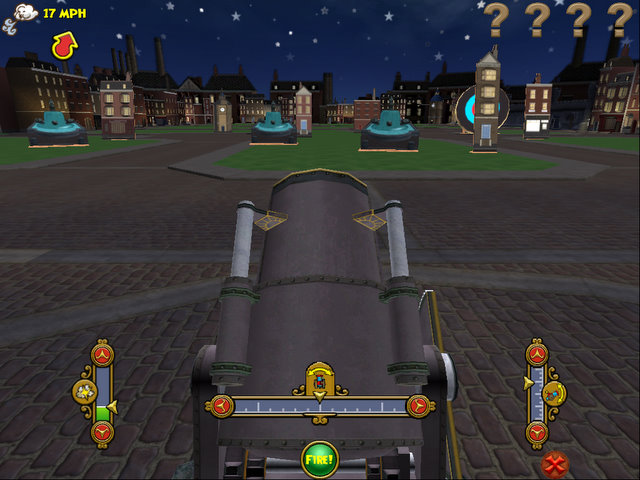
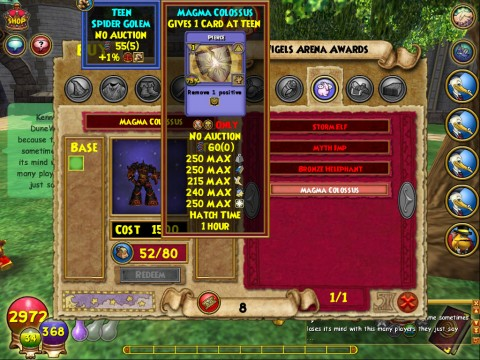
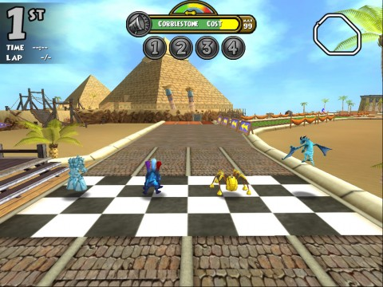

# Wizard101: Pet games coming to an iPhone near you?

*Posted by Tipa on 2010-04-30 06:27:46*

First there was Wizard101, a MMO unlike any other that played in a unique fashion but lived happily on your PC. There were minigames, variants on popular Flash games widely available, that conferred some in-game benefits -- they would refill your mana potions, let you win gold and some magic items.

Their iPhone game WizardBlox took the minigames off the PC and on to the smart phone. Playing WizardBlox on your phone could give your character benefits in game as well -- benefits you could pass on to other players if you liked.

Now on the Test realm are the pet games. You can breed two adult pets to make a new pet with (after you raise it, Pokemon style) a mix of the abilities of the parent pets. (Quote of the night: "WHO WILL BREED WITH ME?")

Past that are the new, pet-focused mini games. There's a Simon memory game, we're you're given a short tune and asked to repeat it; a game where you catch food falling from the sky for points; a Pac Man clone set in a 3D, 1st person perspective hedge maze; a cannon game where you shoot your pet at randomly placed targets, and the Pet Derby, a kart racing game for pets.

[caption id="attachment\_5084" align="aligncenter" width="480" caption="Click to enlarge"][/caption]

Winning any of these games gives your pet a small increase to their stats, which can be improved further by feeding them snacks bought at the pet food vendor. It will take playing the minigames hundreds of times to evolve a pet to its epic status. It will take 1500 Arena tickets (won via arena dueling or the pet derby) to buy a baby version of the best PvP pet in the game, the Magma Colossus (shown above).

Simple games that need to played again and again in order to improve your pet? By a company which has already taken one of their minigames onto the phone? If the pet expansion doesn't sound tailor-made for phone versions, then I don't know what does.

[caption id="attachment\_5085" align="aligncenter" width="480" caption="Click to enlarge"][/caption]

My favorite game? The pet derby, by far. But then, I have always loved Super Mario Kart.
