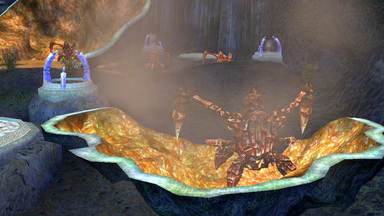
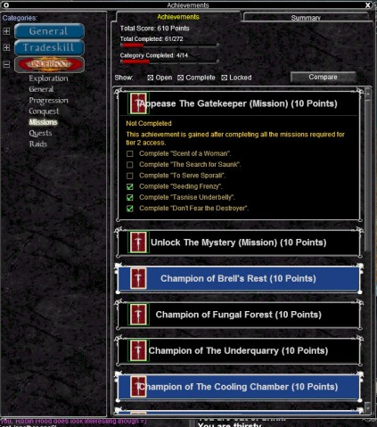

# EverQuest: A significant achievement

*Posted by Tipa on 2010-05-01 16:00:19*

Progression through EverQuest's Underfoot expansion is built entirely through their new achievement system. It's all about the achievement, isn't it? You can get achievements for steamrolling dungeons, doing them without deaths or other limitations (like no crowd control), just exploring new zones.... Not so different from achievements in any other MMO, though perhaps not to the level of World of Warcraft.

In previous expansions, finding your progress through it wasn't all that easy. If you forgot where you were in Kunark's epic weapon quest, too bad for you. Most people kept check lists so they could scratch off each step as it was completed.

Who can forget the clumsy system of glowing tattoos used by the Planes of Power? Or the collections to maintain in the Gates of Discord (such that most people NEVER completed the GoD progression!). Similar issues for each expansion -- you could judge your progression through the Dragons of Norrath by seeing who would talk to you and what they'd offer. The appearance of The Void changes as you reset history in Seeds of Destruction. And so on.

[caption id="attachment\_5093" align="aligncenter" width="423" caption="Click to enlarge"][/caption]

Given all the wonderfully bizarre ways DOE's invented to track progression, it's amazing that it took them until Underfoot to make an actual mechanism for it. But they've done it, and not content with doing anything by halves, pretty much everything you do in Underfoot is tracked somehow by the achievement window.

Typing "/ach" brings up the window. The left bit shows leveling achievements (for leveling and AA points), tradeskills (for leveling tradeskills, also includes a little window showing how many millions of plat you've disappeared while leveling a tradeskill to 300*)

Last on the list are the achievements for Underfoot -- exploration, zone flagging, earning trophies in the boomerang game -- it's all there.

What you DON'T see are the achievements for the OTHER thirty or so expansions. They DO exist -- Planes of Power included a charm that gained power as you unlocked zones, Lost Dungeons of Norrath unlocked better items in the vendors and so on. Without integrating those into the achievement window, it will be difficult to convince any level appropriate characters to slow their progression enough to fully explore and appreciate the game's younger zones. Although the massive reshaping of the classic and Kunark zones in Seeds of Destruction explores what might happen were these zones made into high level playgrounds.

So: achievements. Good thing? I don't know. As a way of tracking progress, sure, why not? But last night we had to restart a mission because someone used a snare and we would have lost the achievement to NOT use a snare. If someone died, well, there went the achievement for a clean run. This is the same sort of weirdness you see in World of Warcraft.

But heck, if they can go back and fill in achievements for earlier expansions, I'd be there for that. Here's some they could offer:

 * Trained Gorenaire to Karnor's Castle

 * Trained Drolvargs to the zone IN Karnor's Castle

 * Be killed by a train inside Karnor's Castle

 * Killed by a train at the zone in Lower Guk

 * Killed by a train at the zone in Nagafen's Lair

 * Drag the Avatar of Fear to the zone in Temple of Cazic-Thule

 * Be ported to the pyramid in the Temple of Cazic-Thule as a low level character by an evil wizard

 * Wake the Sleeper in Sleeper's Tomb

 * Get nerdraged by the uber guild selling Sceptres of Destruction and Gnome Masks for real money because you woke the Sleeper

 * Get a bind at the Qeynos gate

 * Ask someone for a Spirit of Wolf

 * Cast Spirit of Cheetah on someone who asks for a Spirit of Wolf and see if they notice

 * Tell someone you're pretty sure druids don't get Clarity when demanded to buff them with same, give them Harmony instead.
* Get your best friend killed by running them into the steep ramp into Kael Drakkel because you forgot to levitate them

.... and so on.

* no, not really. It SHOULD, though.

