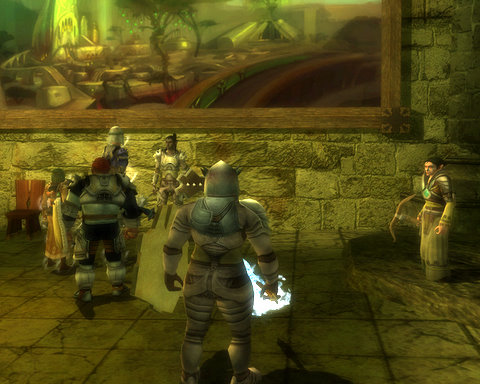
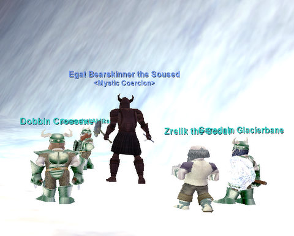
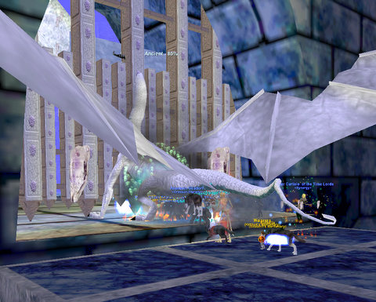
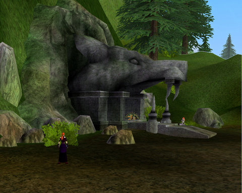

# Weekend Gaming: A little DDO, a lot of EQ

*Posted by Tipa on 2010-05-03 06:24:35*

You say you're about to do "The Proof is in the Poison" quest you picked up in the Stormreach Market? You're standing at the door, about to click in? Wondering how hard this adventure is going to be for you and your pals?

STOP! Just ... just stop right there. Time to take a little inventory of your party's levels. Do you have a rogue in your party? Does this fine person have at least two levels of rogue to their name?

If the answer to EITHER of these two questions is "no", then turn around. Back away. Go tell a tall tale of struggle and woe in the nearest tavern. Because, without a rogue, this dungeon is *Mein DDO Kampf*. No lie.

For a few months, the Sunday DDO static group has been gladly and happily smiling at the traps we can neither see nor avoid, trusting healing to get us through. That ended with this dungeon.

Who'd EVER have thought that someone would make an MMO where rogues actually had a role besides just doing as much damage as possible? EverQuest consistently made rogue special abilities (assassinate, detect/remove traps, lockpicking) useless while giving other dps classes equivalent or better dps. WoW followed that route, and as a result, rogues are among the least popular classes in both games. Both games didn't want a group to rely upon rogue abilities, though they had no trouble making groups rely upon tanking and healing....

Anyway. You NEED a rogue in your group in DDO. Don't assume that just because EQ, WoW and other similar games make rogues pointless that the same applies elsewhere.

Moving on....

I was doing a boring smithing quest in EverQuest's Abysmal Sea (epic related, of course) and chatting with folks to pass the time. Egat mentioned doing his 10th Coldain Ring quest in the Great Divide, and I wanted to be there. The quest turns the Great Divide into a war zone, with armies of giants attempting to take the hidden Coldain Dwarf capital of Thurgadin. The player on the quest becomes a general, and can order squadrons of dwarfs to meet the giant advance, but for good measure they usually will bring an army of players to help.

That was the situation nine years ago, anyway. Today, it's probably soloable. But it was still an event, something you'll rarely have a chance to do in these days of heavy instancing.

Although the anniversary "Fabled Monster" event is over for the year, some of the Fableds are still up, and will be until killed or the server is reset. We went looking for Fableds to kill, and found one in scaly person of the Fabled Vyskudra the Ancient at the bottom of Sleeper's Tomb.

I (naturally) retold my story of waking the Sleeper on Stromm and angering the uber guild who'd been farming the Warders for Scepters of Destruction and Gnome Masks and selling them for real money to people on other servers by transferring them through the Legends server. The Legends server was the center of crime for the entire game; the ability for Legends players to easily move gear to other servers -- something possible at that time no other way -- could turn EQ into a very profitable part time job for many people.

Anyway, we woke the Sleeper, changed ST and ended all that, the uber guild got angry at us, but guess what? It's been seven years and I don't remember any of their names, but I remember waking the Sleeper.

Though the Ancients don't drop the Warders' gnome masks, they DO drop new dwarf masks, and the other rogue and I were hoping the dragon would drop one or more.... it wasn't to be.

The rest of the day was taken up with Seeds of Destruction progression. We started off in the Field of Scale "theme", moved on to Bloody Kithicor, and ended up in the verdant hills of ~~Qeynos~~ Oceangreen. Is Oceangreen what Qeynos would have been called if Sony hadn't published the game? (Qeynos is SonyEQ spelled backward).

The general theme of the Oceangreen quests is to fix time by going back in time and ensuring events go as they were meant to go. In Oceangreen's case, we're to stop the followers of Bertoxxuluous from gaining a foothold, at which we were entirely successful. So why does modern EQ have a whole section of the city (the Catacombs) devoted to their headquarters? I don't know!

The new Blackburrow shares the floor plan of the old one. It's still a horribly confusing maze of twisty passages, all different. Still too many gnolls. Who stink. Just saying.

Anyway, ended the day with access to "The Void 'C'", which is a little ways along the path to repairing time (which will end with The Void 'G'). Apparently, the dragon goddess Veeshan is alive once more, so that balances the dragon I killed in the morning. Kill one, rez one.

