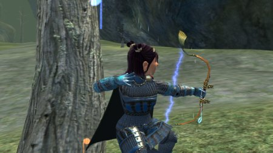
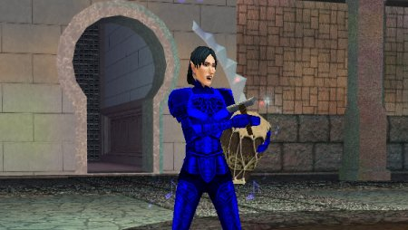

# EQ2: The Fashionable Bard

The Slavering Azid finally let go of his bard legs tonight. I *told* Taps, the other bard (a dirge, poor guy) on the raid, that when he went AFK to get his kid that bard gear would be sure to drop, and it did... but I doubt he was unhappy with the Nightchord wrists and boots he got.

Anyway, my combination of Vhalen's and Nightchord armor just happens to match, so now I look fine in bard blue. After the raid, a couple of us finished the Rain Caller heritage quest, so I got a shot of my new armor and new bow picking off some vampires that were trying to pick *us* off.

Blue's always been the color for bards... but EverQuest 1 bards had little use for subtlety... pastel turquoise? NAAAA... let's do a BLUE.
