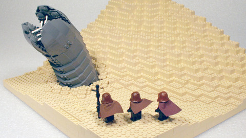

# IPs that SHOULD be MMOs, part 3: Dune

[caption id="attachment\_5126" align="aligncenter" width="480" caption="Click to see the builder\\'s (RebelRock) gallery"][/caption]

It is the best selling science fiction novel, ever. It has been adapted as a [film](http://en.wikipedia.org/wiki/Dune_(film)), a [mini-series](http://en.wikipedia.org/wiki/Frank_Herbert's_Dune), a duology of genre-defining [video games](http://en.wikipedia.org/wiki/Dune_II), a comic, the basis of many songs, paintings, poems and other works. Frank Herbert's 1965 *[Dune](http://en.wikipedia.org/wiki/Dune_(novel))* is as gigantic a presence in the science fiction world as Tolkein's *The Lord of the Rings* is in fantasy.

Set tens of thousands of years in the future, mankind has spread throughout the galaxy, ruled by an Emperor and governed by the Landsraad, a parliament of the Great Houses (noble ruling families). The future civilization is powered by the unique spice *melange*, found and harvested on only one planet in the known galaxy -- Arrakis, a desert planet known as Dune. *Melange* is the substance that makes faster-than-light navigation possible, extends life, and to some, confers prophetic powers. It is prophesied that it will someday allow one person to become a god, the Kwisatz Haderach.

The book opens with House Atreides, rulers of the water planet Caladan, being granted the right to rule Arrakis and harvest its spice by the Padishah Emperor. Displacing the villainous House Harkonnen, the Atreides attempt to bring peace and justice back to the planet while managing the spice harvest and avoiding the treacherous, immense sandworms. Knowing that he is being set up for betrayal, Duke Leto Atreides, the head of the House, forms alliances with the local Bedouin, the Fremen, and with the interplanetary smugglers that supply a thriving black market in spice.

Then everything goes pear-shaped. The inevitable betrayal leads to the destruction of House Atreides as a villainous alliance of House Harkonnen, the Spacing Guild, and disguised Imperial shock troopers invade Arrakis. Only young Paul Atreides and his mother Jessica escape into the desert, to learn the ways of the Fremen and eventually take back their planet -- and rule the galaxy.

The only way Dune the MMO could possibly work would be as a huge PvP game with war on many fronts. Warhammer Online meets EVE Online -- or just EVE Online, but set planetside instead of in space. The politics and shifting alliances of EVE Online's nullsec is exactly what you'd want to see in Dune, the MMO.

In Dune the MMO, the player would start out without any affiliation. Through the tutorial phase, they would join one of the NPC guilds, which would teach them a useful trade -- their class. Available guilds would be the Spacer's Guild (manage and control travel between planets), the Smugglers, the Mercenaries, the Sardaukar (Imperial troops), the Bene Gesserit (priestesses and advisors), the Mentats (human computers), the Ixians (purveyors of super technology), the Face Dancers (shapeshifters and spies) and so on.

Players may eventually join or form a House -- a guild. Every House has its own planet, travel too and from which is managed by the Spacing Guild (having Spacing Guild players manage interstellar travel is a necessity). NPCs on the planet will give randomly-generated missions to allow character growth and further progression in their profession. Using the resources on their planet, the Houses will build their forces and equipment and make war on the other Houses. Eventually, a House will battle for control of Arrakis itself, and until it is dethroned, have a certain amount of power over the entire galaxy.

Dune, the MMO, would be a game that has separate scopes. At the very basic level, you, as a player, are a member of your class -- one of the many unique professions from the Dune books. As you gain influence within your profession, you are able to command more of its resources. As a member of the Bene Gesserit, for instance, you could arrange for clandestine alliances between rival Houses. Higher-rank Mentats could deduce the secrets of other Houses (unless their Mentats are better at hiding those secrets). And when negotiation fails, it will be battles and tactics that determines who gets another planet to add to their collection, and who gets sent screaming back to their ruined world far from civilization.

Dune, the MMO, would be an impossible dream if CCP hadn't more or less DONE it already with EVE Online. Someone better grab that IP and make that game, because I want to play it.

Tomorrow, our series returns to television for inspiration as we explore [Law & Order](http://en.wikipedia.org/wiki/Law_And_Order): the MMO.

