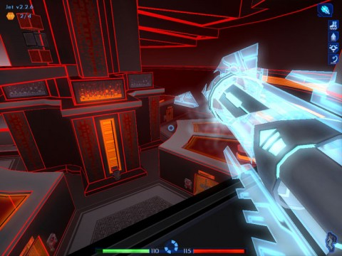

# IPs that should be MMOs, part 5: Tron

[caption id="attachment\_5142" align="aligncenter" width="480" caption="Click to enlarge"][/caption]

This is a softball pitch. Nice and slow and over home plate. Disney's 1982 masterpiece Tron is up for a sequel in December, Tron Legacy, and if someone isn't working on an MMO to take advantage of that right now, I'd be shocked. Furthermore, the folks at Monolith already made a FPS game based on the movie (and not just, for instance, the light cycle game) that is just chock full of great ideas that could be brought right into a MMO. Even Massively thinks [Tron would make a great MMO](http://www.massively.com/2008/05/30/movies-that-could-be-mmos-tron/).

Let's get up to speed.

The computer and hobby magazines of the day were filled with advance news of Tron. State of the art computer graphics, an entirely original plot and characters, it was like nothing ever before seen in a movie theater. It was also a little too experimental for the theater-going audience, and like Blade Runner, which came out the same year, it did not do well at the box office. And also like Blade Runner, time has been kind to it and it is now widely recognized as a classic.

Tron opens as arcade owner Mike Flynn is trying to crack into software company Encom's database using his Clu software. The scene shifts INTO the computer, where we see the program represented as an avatar of Flynn himself, dressed in a glowing costume, driving a video game tank. In Tron, when someone runs a program in the real world, a little representation of them goes about its job in the digital realm.

Cute abstraction? Flynn finds out its all too real as he comes to be digitized and sent into the digital realm to compete on the game grid until the sinister Master Control Program can figure out what to do with him. There, Flynn meets up with the digital avatars of people he knows in the real world (including title character Tron, avatar of friend Alan Bradley), defeats the MCP, is returned to reality, goes home a winner.

2003's Tron 2.0 video game has Alan Bradley's son Jet sent to the digital realm, where imperfectly digitized humans are spreading virus-like through the system. (The new movie, incidentally, has Mike Flynn's son being digitized). Jet must come to grips with the digital realm and his own conversion to save the lives of the humans in the digital realm and his father in the real world.

I'd ~~steal~~ borrow liberally from [Tron 2.0](http://en.wikipedia.org/wiki/Tron_2.0) for a Tron MMO.

Tron the MMO takes place in a world slightly more in the future, where the digitization of humans is common, perhaps seen as a means of immortality. Something Goes Wrong, the programs begin to fight back, and the digital realm isn't so friendly any more. Humans get digitized but never leave, becoming easy prey for killer bots on the grid.

Tron player characters start off with a small amount of RAM in which they can load subroutines -- abilities. Skill at using vehicles (the tanks, light cycles, solar sails, Recognizers and more will be in the game), skill at using the deadly discs, skills at healing and so forth will be acquired through gameplay. Players will typically not have room to keep all their subroutines loaded at once, but will have to swap routines in and out in order to take on the challenge of the digital realm.

As the player progresses, their character gains more RAM, access to better subroutines that are smaller, faster, or do more. Play will likely include many MMO tropes such as killing for experience -- grid bugs always need stomping.

You cannot possibly make a Tron MMO without mini games. These will be the PvP arenas of the game -- racing light cycles, the Tron disc game, tracking down Recognizers in a 3D maze -- you'll be able to get exclusive upgrades by doing well in the games.

Experienced players could even begin to hack the code of the digital realm itself, creating new monsters, devices or new behaviors from scratch by decompiling existing creatures and putting them together in new ways. That's crafting and pet breeding right there.

Breaking into computer systems is integral to the plot of both the movie and the computer game. In Tron the MMO, you'll use a cryptanalysis mini game to open access to new areas. There'll be special subroutines that make this easier or trivial, but a dedicated hacker should be able to open their way through to anyplace given enough luck and persistence.

There's really no IP better for transition into the MMO world than Tron. It's ABOUT video games!

Next up: Visit a world where magic runs unchecked, vampires and demons walk openly, and the apocalypse is always a day away in Buffy the Vampire Slayer: the MMO.

