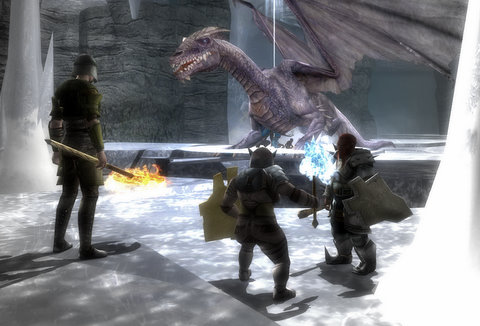
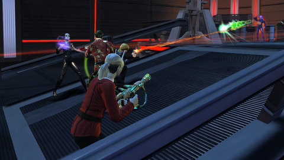
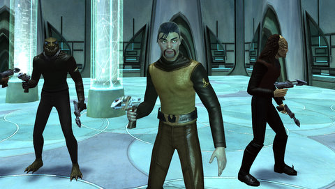
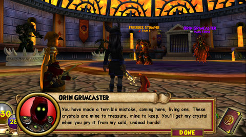
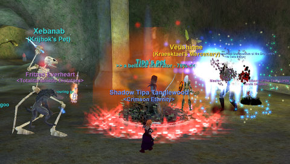

# Weekend Gaming: DDO, W101, EQ, STO

In Dungeons & Dragons Online, Kasul and I finished our trip through all the Korthos Island instances on Elite mode, giving each of us the maximum amount of favor you can get from those quests. Misery Peak, the one where you don't kill the dragon, was its usual platforming mini game of jumping around a multilevel maze looking for levers and fighting ice spiders. Since it was his first time, Kasul didn't know you were supposed to pretend you were actually killing the dragon for uber screenshots. Next time.

The only achievement I have left on Korthos Island is the kill 750 slayer achievement. It's not at the top of my priority list. Looking over the adventures on tap, seems like our next move will likely be into the Waterworks.

In celebration of Bryn Kae's promotion to Rear Admiral rank 5 in Star Trek Online, Longasc and I grouped up with him for some admiralty fun. In State of Q, godlike entity Q warns us of an upcoming Borg invasion in his own playful way -- by putting us all in mortal danger. After, we did some of the dailies. Now, if we can get a couple more of the Federation News Service admirals online at the same time, we can knock out a few of those Task Force missions....

I had this idea for a music video set in Star Trek Online set to Supreme Beings of Leisure's "[Last Girl on Earth](http://www.youtube.com/watch?v=p-neqv-WHB8)", so I went looking to make a Klingon for a love interest. I was happy to see that there were now old school Klingon costume pieces, so I set to making an old school Klingon to wear them.

It was tricky, but with a blown-up picture of [John Colicos' Kor](http://memory-alpha.org/wiki/File:Kor,_2266.jpg) (1.0) on the other screen, I made a younger Kor. I think he came out pretty well. I've been playing him a little. John Colicos also played Count Baltar on the original Battlestar Galactica, and mad freeze ray scientist Mikkos Cassadine on General Hospital. He was a good villain.

For Star Trek Online players looking to make their own old school Klingons, you'll have to use Alien as a template. This means you won't get the Klingon-only sash costume piece... which is a shame.

My balance wizard was nearly level 48 in Wizard101. Level 48 is huge, it's the level you get your last and most powerful spell. Seemed worth the effort to push a little further into Dragonspyre and see if I could make it.

My characters are adventuring in the Crucible, the turning point in the Dragonspyre world where the dragon armies really step up their game. In W101 parlance, this means -- more towers. After battling a few solo bosses, we were sent to Grimcaster's tower, seven or eight fights in a row. In these situations, it's worth taking the time to trim your decks to the bone. We eventually made it through; Allison Goldtalon hit 48 and was summoned back to Krokotopia to receive a new quest from her instructor.

It was to another tower in Dragonspyre. This one, though, she had to do solo, and after a failure mid way through and half an hour in, I gave up for the night. I was trying to hurry things too much, with no proper care to managing health or hiring wizards from the Crowns store to help when needed. I firmly believe that one tower per play session is quite enough, anyway.

Nothing makes groups happen like working on my epic in EverQuest. I was gathering materials for the Test of Smithing when Krijhok invited me to the Cooling Chambers in Underfoot for a couple of missions -- Goos Gone Wild and Goo Will Hunting. Yup. EverQuest has fallen deep into punsville. I set my experience 100% to AA and got to the stabbing. Although I'm not yet max level (only 84 of 85), I'd prefer to get my experience by the chunk through monster missions. The camp and stab missions are best for working through the thousands of AA an EQ player requires. I think I made about fifteen AA when the night was done.

I'm asked all the time if I'll be raiding when I hit max level and get to the minimum number of AAs (likely somewhat north of a thousand). It depends. I know I wouldn't want to raid every night. I'd like to raid ONE night a week; but I don't see that happening. I have a LOT of friends in the Erollisi Marr raid guilds, and they seem like they're having fun....

I didn't get much Pocket Legends progress done this weekend, nor any Dragon Oath... I'll be trying to fit both of those into my schedule this week.

