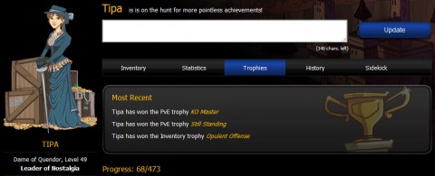
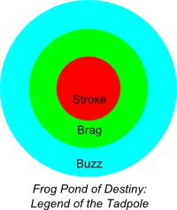
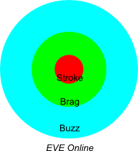
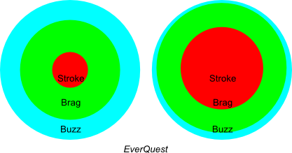
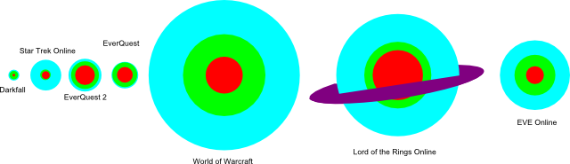

# The Cosmological Theory of Gaming

*Posted by Tipa on 2010-05-19 06:51:28*

So you install this hot new MMO, *Frog Pond of Destiny: Legend of the Tadpole*, play for a bit, start taking on the "Eat 1000 Mosquitoes" quests, get your croak just the way you like it, get that special spotted skin design for making such a big splash. The pond is crowded, but pretty soon people are drifting back to World of Warcraft, and after some time being a big frog in what is really a very little pond, you join them.

It wasn't that *FPoD:LotT* wasn't original or fun. It's just that it didn't matter.

There's no person on this Earth who doesn't want the things they do to matter. Not one person in the world wants to lay down for their eternal rest and have no accomplishments to leave behind. Our entire lives are spent trying to do things that matter. To ourselves, anyway. Our gaming is no exception. MMOs encourage us to spend as much of our free time as possible working on various goals, and those goals matter. If they did not, we wouldn't waste our time on them.

Players and game developers are willing partners, then. Both interested in proving to the other that their time in the game is worth it. This can all be condensed into a single statistic, the "It Matters Index", or "IMI". The IMI of a game is based on the number of people who play, the number of ways the game convinces you you are a good player via levels and achievements, and the amount of buzz the game has outside the circle of people who actually play it. This can be represented as a graph of three circles that I'll label "stroke", "brag" and "buzz".

Clearly, if the game never gives you any sort of indication that you are progressing on the path from newbie to awe-inspiring killer, the Stroke value will be very low. If you don't have any friends who play the game, you don't have anyone to brag to about your stroke. And if nobody who doesn't play the game has even heard of it, then you have a tough job using your stroke and brag to get more people to the game.

Let's look at the IMI for some popular games.

As a more or less purely sandbox game, EVE offers very little stroke. Your progress in skill training and the number of ships in your hanger, even your total wealth, none of these things are easy to show. Brag is fairly important; by belonging to a given corporation or alliance, the accomplishments of perhaps hundreds of other people become YOUR accomplishments as well. And finally, EVE has a huge buzz. It's the only game I know of where news of crime and fraud make the mainstream press, leading to the thousands of EVE players hoping to make that next massive con. Each fraud that DOES make it into the news brings in more new EVE players. The power of buzz, positive OR negative, cannot be denied.

EverQuest, the first of the modern fantasy MMOs, is a very different game now than it was in the beginning.

Old EQ had fairly low Stroke -- your level and your total mana or hit points were about all you could brag about, as every other statistic was capped. The armor all looked the same, differing only in shade and occasionally pattern. However, nothing in the world was instanced, which meant your actions and those of your guild could potentially block anyone else from reaching content. Finally, as the first really popular 3D MMO, the game had enough buzz to carry the genre to the next stage.

Modern EQ is a very different game. You now get achievements, broadcast to your guild and people in the zone, for everything you do. The quick pace of advanced achievements give you a "ding!" moment several times in a play session. The weapons are more elaborate and ornate than ever. The EQ stroke is very good. Since progression is marked on a fixed ladder, it is easy to brag to your fellow players about your position on it, though now that EQ progression is entirely instanced, nothing you do in the game has any effect on other players, diminishing the brag somewhat. And as is only too common with games of its age, EQ has nearly no buzz at all.

The relative size of the graphs varies from game to game. One can see that the IMI graph for a game like WoW would be immense, while one for a game like, say, Hello Kitty Online would be relatively small. To the IMI then, we have to assign another score, gravity.

The hot, dense core of stroke would contribute a lot to gravity. The brag-o-sphere somewhat less, and the important buzz would be the least massive but the most impressive. 

Arranged according to IMI gravity, it becomes easy to see why players tend to be attracted to certain games. A good, dense stroke and brag will keep people happy, and a thick buzz will obscure other games for awhile, but once someone travels beyond the atmosphere of their first game, it's hard to ignore the pull of the truly massive giants of gaming.

