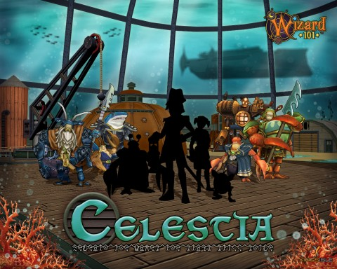

# Wizard101: More Celestia!

I dunno how much longer I can take this dribbling and drabbling of Celestia information. I've done the pre-quests (well, on Test, anyway), met one of the Celestia generals face to claw and learned of the evil reign of Queen Umbra.... Time to wand up and take the battle to the evil queen and rescue those poor Marleybone explorers.

But ... not quite yet.

Wands down, wizards.

On to the subject at hand. New Celestia is going to be absolutely sick with powerful enemies and a few powerful friends. I don't know into which camp the blue-plated fellow on the left falls.... I kinda hope he's an enemy. Because Malistaire was kinda weak and sickly, except those couple weeks he was powerful. 

It's time we all had a challenge, but you know? I do hope that we don't need to FARM this guy. He deserves better.

