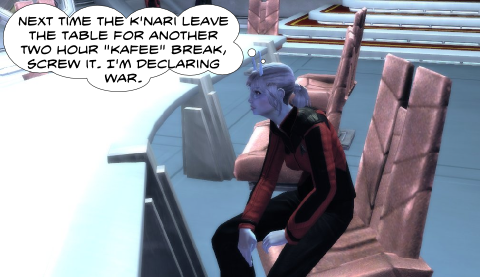
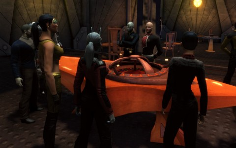

# STO: How to Choose Your Dabo Girl

*Posted by Tipa on 2010-07-10 21:23:24*

Season 2.0 is out on Star Trek Online's test server, Tribble, now, and they've just stuffed the game with new goodness. Five new levels, which bring you from Rear Admiral, LOWER HALF to Rear Admiral, UPPER HALF. As @Longasc noted, get them together, you end up with one WHOLE Admiral, or maybe a FRONT Admiral.

Yeah, that title is silly, has got to go.

With the new levels come new missions that bring you to the realm of the only creatures that can scare the Borg, Species 8472, AKA the Undine. Creatures who come from a universe where there is no vacuum, no stars or planets, only a weird, dense infinity of force lines known as fluidic space, and the strange life forms that swim among them. They hate we puny beings made out of inferior baryonic matter.

Diplomacy brings a new career path to the Federation. You gain diplomacy points via aiding alien planets, but also by meeting new alien species and settling disputes. These special diplomacy missions range from the very simple to the extremely complex; the best one I tried required much investigation, research, and questioning to uncover the truth. Gain 160 points, and you can be an ambassador, and wear the special ambassador suit.

Here's me not including the obvious picture here. I hate that commercial. Here's me not explaining that. If you don't know, you're better off.

Anyway. Diplomacy is a definite win, but there are only a limited number (so far) of the diplomacy missions, and at 10 points each, you will run out long before you become an Ambassador. You'll be hoping for Aid the Planet missions now.

Harvesting has gotten a new mini-game. Instead of just getting close and hitting 'F', you now have a few seconds to match the amplitude and frequency of one sine wave to another for a chance to improve your harvesting haul. It's not as hard as it sounds (or looks).

Quark's Bar in Deep Space 9, and a couple of other places, have received permission from Starfleet to open up their Dabo tables to Federation officers. You can try explaining to a Ferengi about how the Federation has evolved beyond the need for material wealth and 'money' all you like, but he'll just quote the 75th Rule of Acquisition at you, and lend you a slip of latinum at a very reasonable rate of interest just to help you get started.

Dabo!

Dabo, never really explained in any of the TV series, turns out to be a method for turning energy credits into great big piles of gold pressed latinum. Half an hour of play should net you about 300,000 bars. Quark's Bar is worth about 5,000 bars of gold pressed latinum, by comparison. In all honesty, the game never specifies if you are winning slips, strips, or bars of latinum. 2,000 slips to a bar, and that 300,000 slips becomes 150 bars, which is still a lot of money.

What to buy with all that latinum? HOLO-EMITTERS!

Holo-emitters are fifteen minute illusions that make your ship look like an alien ship. They were so common on Tribble that everyone had them all, making them pointless -- why bother getting something everyone has, that gives no in-game benefit? Maybe they will add a reason.

It sure makes making movies in-game easier. At the bottom of this post, I'll show a gallery of most of the illusions, and you'll have saved all that time at the Dabo table.

So. Good things: Diplomacy, Fluidic space missions.

Bad things: Stupid "Upper Half" and "Lower Half" titles. No playable Romulans. No diplomacy for Klingons (and why not? In the original series, the Klingons were ALWAYS competing diplomatically with the Federation. Rommies were the warlike ones.)

Neutral things: Dabo and ship illusions. Didn't notice ship interiors, but you do get a conference room for diplomacy.

Season 2.0 is a good and much needed patch. Also included are many bug fixes and changes intended to keep the challenge adequate but not punishing. still waiting to play a Romulan, though, or for Klingon game play that is as fully fleshed out as the Federation's.

[gallery link="file"]

