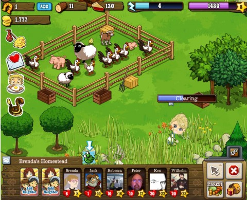
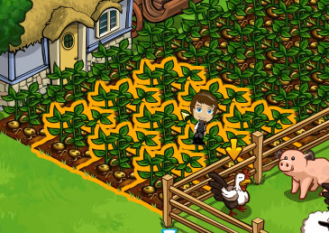

# Zynga's Frontierville is Capitalism for Kids

While yesterday's look at Playfish' "My Empire" showed a game that at least reminds us of an actual game -- a city simulator in the vein of the popular Caesar series -- the core gamer saves their real scorn for the ubiquitous clicking games that made Zynga into the gaming powerhouse it is today. Make no mistake about it -- Acti-Blizzard, Electronic Arts, SOE and every other game development studio is taking a hard look at these games.

If the brightest and best minds in gaming say clicking games are the future of gaming, then those who say it is not are probably wrong. I HATE being wrong. So for the past week, I've been homesteading my way through Zynga's Frontierville.

Similar to Farmville (a game I have not played) and many others, Frontierville has you build a place of your own from nothing. Though you can play the game to some extent solo, to advance in the game, you will need the help of friends, as only friends can give you certain items that you will need. They, in turn, will rely upon you to give them the things they need, and together, your little corners of Facebook will become lovely places indeed.

Set during America's westward expansion in the mid 19th century, you take on the role of a person who has just arrived, via covered wagon, on their own little homestead. Your ~~forty~~ four acres are covered with grass, trees, stones, trees, rattlesnakes, foxes, trees, skulls and trees. After sending notes to your friends letting them know you've moved into the area, and to your spouse back East letting them know you arrived safely, you set to clearing the land, building a home, and learning the basics of raising livestock and planting crops.

It's at this point the real game begins. Because (as much as they would like you to think it is), Frontierville is NOT a remake of the famed westward expansion game, [Oregon Trail](http://en.wikipedia.org/wiki/The_Oregon_Trail_(video_game)). Frontierville is a primer into the basics of investment banking.

There are many goals in the game, but the primary one is familiar -- to make as much money as you possibly can. Most every other goal requires help from your network of fellow players, but this one is yours alone. Getting filthy rich allows you access to the best items.

Success in Frontierville is based on INVESTMENTS.

 2. **Capital Investments.** One of the first things you will do is build a home; afterward you'll add a general store, a schoolhouse, a town hall and all manner of things. Each opens up new possibilities, but all are expensive and rely upon help from other people. (My character's husband is still waiting on friends to contribute more items toward the building of the general store he, for some reason, requires before he will make the trip). Just as in the real world, capital investment is expensive and requires long-term thinking to realize any payoff.

 4. **Short Term Investments.** These investments have a guaranteed rate of return and a finite term -- the real world analogue would be **municipal bonds**, but in Frontierville they are called "crops". Money sitting in your bank is NOT working for you; the Frontierville bank pays no interest. If you want your bank account to grow, you need to put that money to work in the fields, growing crops. Your ability to harvest crops in a timely fashion is limited by your "energy" (which is limited by your level), so it becomes necessary to balance yield and return. Typically you will want to go with a limited number of high value investments. Eggplants seem to be the best this season.

 6. **Long Term Investments.** Livestock and orchards have a substantial initial cost and take time to mature, but once they do, they return dividends based on their term. If you plan to be playing for awhile, you would tend to focus on high return, short cycle investments like chickens, and spend spare energy on long cycle livestock like horses or cattle when you wouldn't be playing for awhile.

Since each investment guarantees a payoff, you will be able to accurately judge how best to invest your energy. It's easily possible to invest to heavily in short term investments, such as crops, and become unable to harvest them rapidly enough before you run out of energy and your crops potentially begin to wither. Long term investments don't share this penalty, but the return on investment is somewhat less, and requires careful management.

Luckily for you, Frontierville has a solution: **migrant farmhands**. It may take YOU ten clicks to harvest your crops, but you can hire a migrant worker to harvest nine of them for NO clicks (but for 50 coins). Your friends will do all the heavy work for you, and all you have to do is count the coins, food and experience as they stream into your bank. Too bad you can only hire migrant farm workers twice per day.

As a social game, Frontierville is awesome, at the top of its genre. There's always something you can do on your farm; energy refills quickly enough that you'll be able to pick up some quick cash by feeding livestock or food by picking fruit. Completing Frontierville quests normally requires visiting neighbor farms and helping out; if you're lucky, the friends will notice and send you something you need. Back at the farm, there's always something that needs tending, and the requirement that you keep all your money invested makes shopping more than just recreation, but a vital necessity.

As a GAME game, well, there's really no point to the game. Eventually, every player will accomplish enough of the goals to be satisfied, or find some other similar game that their friends play and move on. If their friends keep helping out, the homestead can continue to thrive without them.

Frontierville will never be the sort of game that, on your deathbed, you regret not spending more time playing. But then, most games just fall into the broad category of things you do when you haven't anything else to do, and with this one, at least you're learning valuable lessons about capitalism.

