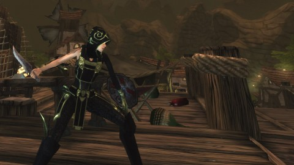

# Chronicles of Spellborn: Anatomy of a Failure

[caption id="attachment\_5498" align="aligncenter" width="480" caption="No other game looked like Spellborn"][/caption]

The Chronicles of Spellborn seemed to provide a wish list of what people want in an MMO. You could look cool from day 1; the gear you chose at character creation could be upgraded by slotting in runes to increase their power. You could still find or craft items with more or better slots, but there was never a time when your character would have to look anything but cool as sheets.

Combat was tactical on many levels. You could not access all your abilities whenever you liked; not only were most of them on cooldowns, but you could only choose from the abilities that were showing on a scrolling deck wheel that would shift whenever you used an ability. The abilities themselves were fairly weak alone; but if you built your deck well and arranged the combos in logical ways on the wheel, abilities could build upon each other to become truly devastating.

The art was state of the. Rendered in a uniquely European style, Spellborn looked like no other game. The lore told a story of a shattered world, populated by survivors rescued from the planet just before it went boom by benevolent godlike beings. The shards of the planet still swirl in winds of the Deadspell Storm, and the people live inside caverns carved within them. Voyages between them are only by taking passage on shard ships, which might themselves be attacked by denizens of the Storm as they make their way.

Players want combat mechanics that are more than "Press 1, 2, 3, repeat"? Spellborn had it. Unique world, graphics, and UI? Spellborn had it. Some of the coolest looking gear in any MMO? Nailed.

So, what happened?

Though the Spellborn devs had a long relationship with Frogster to publish the game in Asia and in parts of Europe, they had no American publisher. When they eventually made a handshake agreement with one, they were barred from revealing it for months, while they did some retooling on the game. After months of no news, the publisher was revealed to be Acclaim, a publisher most noted for its free to play games.

The game then went into further hiatus for five more months.

Eventually, in February of 2009, Spellborn went live in the US and the rest of the world. Instead of a standard subscription plan, players needed to by Acclaim's cash shop currency, and then redeem that for play time. It was fairly complicated, and since people would be spending different amounts to play the game depending on the deals they got for the cash shop currency, it was hard for people to figure out just how much the game cost, and whether or not they were getting a decent deal.

Acclaim promised heavy support for the game, but when it became clear Spellborn was not a hit, such support dried up. In just a few months, rumors arose that the developers, Spellborn N.V., had all left to find other work, and that the game would be moving to a F2P model with an item shop (for a game without a focus on items!) and other such paraphernalia. The game was to be relaunched to begin again as a MMO like most of the others in Acclaim's stable, but instead, was just set to be free and left alone, patchless, until the decision came to close the game down.

Spellborn Lead Developer El Drijver has posted a [complete (and more correct!) timeline](http://phpbb.acclaim.com/spellborn/viewtopic.php?p=49217#49217) on the Acclaim Spellborn forums. 

Even aside from Spellborn's issues with its publisher and the game's lack of heavy promotion, the game itself may have taken too many chances.

Though soloing was an option in the game, the game itself was fairly hard to play. Having to keep good aim on an enemy while avoiding enemy special attacks (most enemies had a unique 'tell' you could use to determine when they were about to unleash a heavy attack) meant it played far more like a third person shooter than an MMO. Slow travel times meant it could take a considerable amount of time to get somewhere new; shard ships ran on their own schedules and were sometimes dangerous to boot. There were no gates, hearthstones or teleports; it was a worldy-world.

Aimed directly for hardcore players, Spellborn had very little to recommend it for casual players, and this was probably its biggest mistake. By basing its combat on an intricate combat mechanic that demanded the player's full attention, Spellborn shut out the 90% of casual players that are absolutely necessary to populate the world. Without the casual players, even the hardcore players noticed the world was fairly empty. The PvP clique soon moved on to other games; the hardcore players leveled to the end game and then, with nothing left to do, departed; and the few casual players had already gone.

Hundreds of MMOs, it seems, are released every year, but few of them take as many chances and are as filled with new ideas as The Chronicles of Spellborn. Out of all the hundreds of MMOs, it seems, that FAIL every year, I'll miss Spellborn the most.

