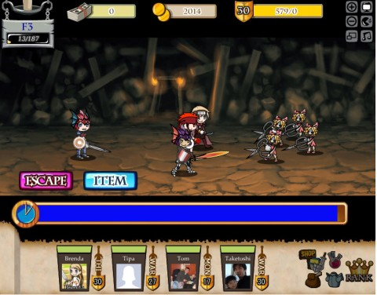
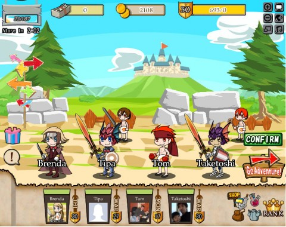

# Treasure Abyss: Not your ordinary social game

*Posted by Tipa on 2010-08-31 07:07:29*

I thought I would never find a game on Facebook that tied together social gaming and RPGs. This whole experiment with Facebook games has typically been one spam-filled sim game after another. Frontierville, City of Wonder, My Empire, Virtual Villagers -- all share the same half-hearted copying of better single player games combined with a financial urge to turn the player into a whining beggar who is a burden on their friends.

If that's all "social gaming" is, then I don't care how much money Zynga is making, it's a dead genre before it's even fully born. Creatively dead, anyway. Even the most patient and enthusiastic player has to get bored with yet another sim at some point.

I asked Twitter if there were any actual, honest to God RPGs on Facebook, and @Caffo sent me a link to Namco Bandai's [Treasure Abyss](http://www.facebook.com/apps/application.php?id=110417579004579).

If you've ever tried to get a guild group together in a traditional MMO, you know how tough it is to get all your friends online at the same time, and also wanting to do the dungeons you need. Wouldn't it be so much easier if you could just hire their offline characters as NPC hirelings?

That's the concept behind Treasure Abyss. You form a four person party from you and three friends, then head into dungeons, kill everything you see, loot treasure, repeat. Every fight, the character with the most kills gets a "MVP" award, which gives them gold the next time they log in.

You start out as a generic warrior. After a short tutorial, you come to the main party selection screen, where you can customize your character as often as you like. You also can choose among the friends who play. There doesn't seem to be any penalty at the moment for grouping your level 1 character with level 30 friends, so go for it.

Your profession -- warrior, wizard, thief or monk -- is determined by the weapon you wield. Everyone starts out as a warrior. In the first dungeon, you will find the materials with which to make wizard staffs. In the second, you'll find hand stones; you'll make thief knives from those. The third dungeon hides fist stones that make certain monk weapons.

Alchemy is crafting in Treasure Abyss. All items looted are alchemy components. You can only make weapons and bits of candle at the moment, though. Armor, shields and headgear are bought at the store for in-game gold. The only cash item so far are candles.

Candles are the resource that keeps you from playing as much as you like. Each step you take in a dungeon reduces your candlepower by three. When it reaches zero, the dungeon goes dark, and any monsters you stumble into will become nearly impossible to hit. You, though, will become much easier to hit. Sufficiently strong characters will be able to continue on even in the dark, though you'll need at least a smidgen of candle in order to descend to deeper levels.

The game is in beta, and it must be an early beta at that. There's only three dungeons; some of the crafted weapons are apparently impossible to craft; the cash shop isn't open; it takes far too long for beginning players to earn enough gold to buy even the most basic armor. The game isn't 100% there yet.

But even in this early stage, Treasure Abyss has given me more RPG-style enjoyment than I'd any right to expect on Facebook.

