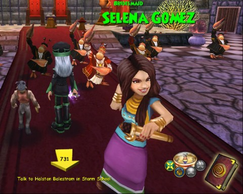

# Is Wizard101's marketing getting out of hand?

Seriously, KingsIsle? You're blatantly shilling teen actor/singer/Disney creation Selena Gomez's new CD in the game? It's the one that's driving all the amphibians and crustaceans in the Spiral MAD! Talking fish can't get enough of her intoxicating beauty! The indescribable sweetness of her music! She MUST become queen of Crab Alley!

Except that her parents would freak that she, like, disappeared. The same way all the parents of every other wizard in the game (all presumably separated from their families back on Earth) don't.

The only two explanations I can think of: Disney is paying KingsIsle barrels of money to flog their latest media darling to children, or Disney is about to continue what they've started with Playdom and other casual gaming entities, and buy out KingsIsle entirely. If that does happen, expect to see a LOT MORE Disney stars somehow find themselves in the game, desperately needing the help of child wizards to get back home or at least to buy their new CD.

Look, even the crabs are dancing to it! Reminds me of [the Lobster Quadrille](http://www.authorama.com/alice-in-wonderland-10.html), actually. Do kids even read Alice in Wonderland anymore?

Here's some more of KingsIsle's crack marketing team in action:

Both of these ads are from Facebook. The one on the left is a Wizard101 ad.

> WizardVille? Like the Frontier Game - just faster, better, harder, stronger! Better name too. CLICK HERE to see what all the hype is about!

Wizard101 is nothing like "the Frontier Game". FrontierVille is a standard Zynga clickfest combined with a metric crapload of friend begging. Plus, it's integrated with Facebook. Wizard101 is a client-based MMO more similar to World of Warcraft than any Facebook-driven Flash sim game. The comparison to FrontierVille seems entirely arbitrary. Why not say, "Interested in the search for the Higgs boson? It's like the Large Hadron Collider but bigger, stronger, more radioactive!" As is now nearly standard for Wizard101 ads on Facebook, the picture has nothing to do with the game whatsoever.

On the right is a mocking ad from Kingdoms of Camelot, which claims to have taken all the fun and strategy of a standalone MMO like Wizard101 and put it all in a Facebook Flash-based city building sim. The picture is straight from the game.

The Gomez quest does bring you to Crab Alley, which shares the same underwater setting as the next expansion, Celestia, due out in a week or two. Was the expansion delayed to shoehorn this advertisement for a Disney package into the game?

Anyway, the quest is live on the Test Realm. Basically, the Storm Professor frog, the same one who has been leading the rediscovery of Celestia, just got a new CD player, and The Best Song In The World is playing on it. He traces it back to the Most Beautiful Girl in the World, Selena Gomez, who is being held prisoner in Crab Alley. Some side quests get you access. You go there and find out Everyone Loves Selena Gomez in Crab Alley! Go Selena! She's to be married to a crab, but she really needs to get back to recording her New CD! The Crab King goes wild, and enlists his entire court to be background dancers for Selene Gomez, who now holds a microphone! And never stops smiling! Even when faced by marriage to a crustacean. Well, now that some states allow gay marriage, looks like the warnings were true: people will start marrying animals.

I'm among Wizard101's biggest fans, but this new marketing direction... I'm just not feeling it. Seriously. I was apprehensive about Eric Bloom's quest, even though Blue Oyster Cult is my favorite band. (Maybe he should have had Michael Moorcock help write it?)
