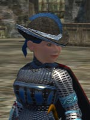
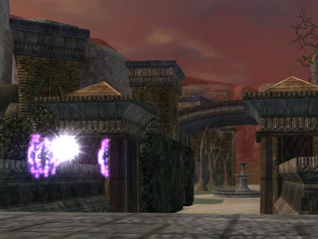
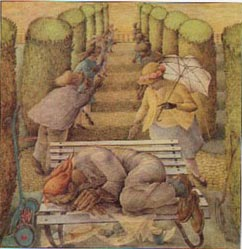
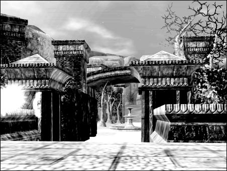

# EQ2: Unrest, a little further in

After last night's Labs raid, I got to go a little deeper into Unrest. But first, a little bit of patting-my-own-back-ism from the raid :) Not only did I get this dapper little hat I've been wanting ever since I saw it in the hatmaker's window in East Freeport, but I got the kill shot on Lord Vyemm. So (ahem):

WOOOHOO! HAFFER KILL! BWAHAHAHAHAHAHAHAHAAAAA!

Sorry about that.

So anyway, after *American Idol* and *Lost*, a couple of us went to Unrest and poked around a little. Two of the people in the group took FOREVER to get there, like half an hour or something, so it was pretty late before we actually got going.

The zone... is beautiful... and every bit of it just slams you with nostalgia. That gazebo off to one side in the original EQ? It's there in this one. And you kill death beetles to get to it! We wandered into a room inside and I just kinda chuckled and said, back in EQ1, those bookshelves opened to a hidden staircase (you know the one I mean if you ever played EQ1 back in the day).
And... they did here, too.

The monsters -- not as hard as I thought they would be. The zone is a series of puzzles. The first was to find two halves of a key to enter the mansion, which were scattered in the hedge maze. Clearing the hedge maze was supposed to spawn Bugaloo, a monster which (supposedly) drops the EoF legendary set head armor, but it didn't spawn for us.

A fun zone and powerfully nostalgic. I'll be spending a lot of time there -- it's not such an unrewarding zone of horrid death as Mistmoore Castle (which, unsurprisingly I guess, was an unrewarding zone of horrid death in EQ1 as well, for the level range).

Here's a view from the mansion looking back through the hedge maze. I loved its storybook feel... it kinda reminded me of a Genesis album cover (specifically the one for *Selling England by the Pound* mixed with a little *Nursery Chryme*).

My first experience with Unrest, back in EQ1, was farming beetles for Pristine Scarab Carapaces with which to make Scarab armor. I had a little business making that gear "way back when".

My second was losing my corpse deep in Unrest and my guild coming out to clear to it and drag it out. United Norrath Coalition FOREVER!

New Unrest: Good stuff, and it makes me excited about seeing how the EQ2 devs will update the old dungeons from Kunark. I think they could do something pretty amazing with the City of Mist.

More: I was playing around with Photoshop and the Unrest screenie, and I thought this inked version came out nicely and brings out the storybook quality of the zone better than a straight screenie.

