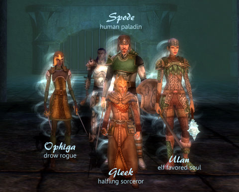
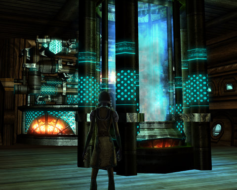

# Dungeons & Dragons Online: The Seal of Shan-To-Kor

While the rest of the group wasn't looking, I nailed their boots to the floor. It's the only way I can get people to stop moving long enough for a picture!

We're here just outside the room in which is hidden the Seal of Shan-To-Kor. We were sent to retrieve the Seal and upset the local hobgoblin tribe enough that they would stop attacking folks. 

A word about traps.

There was a frickin' ROOM FULL OF FIRE down there. AND a hobgoblin village, looking as nice as you like. Plus, ROOM FULL OF FIRE. Who the HECK builds a ROOM FULL OF FIRE near their homey village? Think of the children!

I don't care, really. I play a rogue, rogues have excellent resists. Mostly I survive the traps I can't disarm. Mostly. There was one trap, though, that had me stymied -- a fire trap on a ladder. With fire resist potions, I passed that fine, but hobgoblin clerics had me in a continual Hold Person bind while other hobgoblins cut me to shreds.

I'd run the module solo a couple weeks ago, so we had it open on hard. And mostly, we did okay. There were some major fights that saw twenty hobgoblins dead and us still standing. Traps were our biggest issue. It would have been much worse without a rogue.

I'm now in a guild -- GAMERS! It was a random guild invite. Gleek and Ulan had already joined guilds, different ones, and were enjoying the guild airship and... the guild airship. I don't think their guilds group, or something. I'd had the impression that we were all going to join the SAME guild, but it didn't work out that way. Gleek took the plunge first, Ulan soon after, and I was just wandering around hoping someone would eventually invite me to their guild.

When I played my Hobbesian cleric, I got guild invites all the time, even though I was IN a guild, Massively's OneDAwesome.

Anyway, I jumped at the first ninja guild invite that came my way. Nobody talks or anything, but they do have an airship. They also have a kick policy, nicely posted on their Guild Message of the Day: If you have not been active for three weeks, it said, you will be kicked. Great message. How are the inactive people ever going to see it? I wondered in guild chat. It's now been changed to be a simple statement of policy. Something to do with guild renown.

Guild Renown -- this whole guild leveling system -- is such a ripoff from EverQuest II. You loot tokens which give renown to your guild; killing certain monsters gives renown. It's just all too familiar. Aside from gaining an airship. I understand further renown and money will purchase guild amenities such as buff bots, but at the moment, all the airship really offers is instant travel around Stormreach.

Seems like you should be able to actually fly it, up in the sky. But it does look kinda cool, kind of like a Spellborn shard ship crossed with the engine room of the USS Enterprise. I swear that's a warp coil.

Next week, we finally take on Three Barrel Cove. We're almost past the point I reached with the Massively crew; I'm really excited to see what else DDO has to offer.

I understand we'll be seeing beholders at some point! But what I REALLY want to see is a dragon. And not one like in the tutorial island, that you could just stare at from afar. I mean, one you can kill, or at least ride. When the Red Star shows through the Stone Eye, Thread will come. And when Thread's in the sky, Dragons fly.

