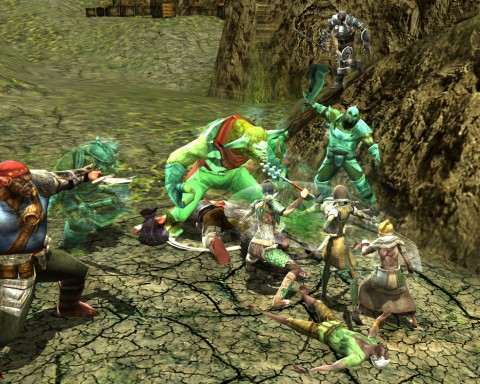

# Dungeons & Dragons Online: Three Barrel Cove, Part 1

*Posted by Tipa on 2010-10-26 07:08:15*

Picture, if you would, a pirate. What are the job qualifications for a pirate? Well, what qualities would best fit a life about ship? Nimbleness of foot? Ability to climb rigging in the harshest of winds? Perhaps not needing a lot of living space, since quarters below for pirates or seamen of any sort are little more than a bunk hung wherever there's room. A ready wit, a keen mind, deadly with blade or blunderbuss?

Now, picture a minotaur. Half man, half cattle. Known in antiquity for spending its entire life lost in a maze, so not very bright. Very heavy. Very bulky. Very clumsy. If you were advertising for pirates for your pirate crew, and a minotaur showed up, would you really hand it a bandanna and a peg leg and welcome it aboard?

No, of course not. You'd have a good laugh and send it straight down to Three Barrel Cove. Three Barrel Cove just has too much barrel to be contained in a one barrel cove.

Three Barrel Cove is a huge module intended for groups from level 4-7. Team Spode (to give us a name) are levels five and six, so we're in an excellent position. Ulan has, I think, been through this before, but it's new to the rest of us, so with no little sense of excitement, we boarded the boat in Stormreach Harbor and set off for the pirate-infested waters of the Cove.

I'd gotten there a little earlier, and found a named pirate minotaur right at the docks. He would lumber around and occasionally charge, at which time I would tumble out of the way and hit him from the back. Minotaurs are REALLY not cut out for the pirate life. Well, I guess EverQuest had its Broken Skull Rock with its pirate trolls, and World of Warcraft had its Deadmines with a pirate minotaur (ding!), so, really, Eberron couldn't be seen without its own pirate monsters.

When the rest of the group showed up (me: Ophiga, drow rogue; Gleek, halfling sorcerer; Ulan, elf favored soul; Spode, human paladin), we soon found ourselves in a fast paced battle to save a ship from being boarded by pirate hobgoblins and pirate troglodytes. We had to save all but five of the defenders, and man, there's nothing these folks liked better than getting themselves killed. I'd failed on this ship earlier because they would just go looking for ways to die. Trip on a stay; strangle on the rigging; accidentally fall into the water and drown. The clumsy are ALSO not the best crew for your ship, right behind minotaurs.

While fun, it wasn't very rewarding, and we had bigger plans. We headed deeper into the cove.

A word about Spode. Here is a man who loves gravity like a minotaur loves hay. If there is a point above another point, and the party is at the higher point, Spode will be at the lower point, haven fallen there (or been pushed by ~~Gleek~~ a mysterious arcane force which our sorcerer cannot explain). In any normal party, such a devout student of Newton's Laws would be a curiosity, but this is no normal party. Where Spode falls, we follow.

His first discovery was Garl's Tomb. We were on a bridge over a waterfall, headed to the Fire Caves, when Spode fell off and made a discovery: a cave behind the waterfall. The tomb was a trog-infested place where I fruitlessly tried to detect the trap that was flinging fireballs at us while the rest of the party went and killed the trog warlocks who were the actual danger. A series of platform jumps had the usual outcome (Spode swimming below), but soon enough we had destroyed enough of the eggs, and the Chieftain, who was in fact below and encountered first by Spode.

There was a second part to the quest, but since the Fire Caves must be close, we thought we'd knock that off first.

Along the way were several bands of pirate trogs, hobs and minos. One band had barricaded themselves behind a wall of spears, upon which Gleek and I cheerfully impaled ourselves. Oops.

We eventually made our way to the Fire Caves, which was another Super Mario level. Platforming seems to be quite the hobby in Three Barrel Cove. Spode took the lead exploring the lava pools below, single-handedly destroying one of the altars to the Dragon Below which was actually pretty amazingly heroic of him. The rest of us spent at least a little time dead, usually because of a fall to the lava. Platforming. Who would build this? My evil lair will be well-built, with good lighting and no weird traps or stuff, because I guarantee, I'd be caught in my own damn trap while the hero laughs maniacally.

With the Fire Cave quest advanced to its next stage, we headed back to the Cove, taking on the various pirate bands along the way in the search for rare nameds, exploration and slayer achievements.

We didn't get too far in the module this week, but I don't think any of us mind sticking around another week or two to see how much experience we can get out of it.

Except, perhaps, for Spode.

Can't get enough of rockem, sockem, minotaur action? Check this out!

[Minotaur China Shop Trailer](http://vimeo.com/2474951) from [Flashbang Studios](http://vimeo.com/blurst) on [Vimeo](http://vimeo.com).

