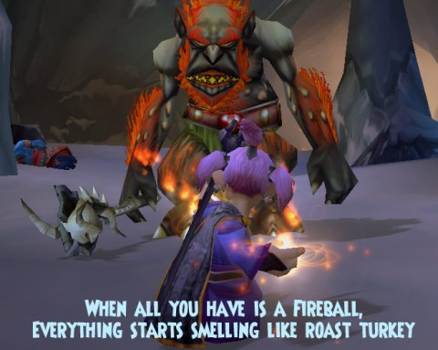

# Daily Blogroll: Thanksgiving Edition

*Posted by Tipa on 2010-11-25 19:49:34*

It's Turkey Day in the USA, the day when we all gather together with our families and other loved ones and try not to talk about gaming. I kinda failed at this this afternoon when I was talking to my daughter and she wanted to talk about the new gnome starting quests in World of Warcraft...

Time to start talking turkey.

**Blockbuster Free MMO 4Story reveals its [secret of 3rd Kingdom](http://www.gamekicker.com/gaming-news/blockbuster-free-mmo-4story-reveals-its-secret-of-3rd-kingdom)**

Seoul, Korea – blah blah blah. Blah blah blah blah blah. Blah, blah blah blah! Blah blah; blah blah (blah) blah.

Ooops, sorry, I accidentally deleted the article once I read "Korean free to play fantasy MMO." So just make up some words. Wait; let me just riff on the theme. "In a truly original and groundbreakingly refreshing blockbuster sensation, 4 Story uses it's 3rd Kingdom the 2nd time around to make a Number 1 fool out of the player! With cute but creepy anime graphics based on a best selling manga, barely dressed nubile girls fight colorful monsters and compete to become the destined ruler of the land!"

Nobody's actually going to remember this game in ten minutes, so it wasn't worth the thirty seconds to read the article.

**Glitch gets inside your head** -- assuming you're one of eleven fabled giants, anyway.

My friend and occasional [Nomadic Gamer](http://nomadicgamer.com/) contributer Kasul linked me a video of an unusual game called "[Glitch](http://www.escapistmagazine.com/news/view/105607-Flickr-Co-Founder-Developing-Experimental-MMO-in-Giants-Brains)". It has a theme song! I'm a sucker for [a game with a good theme song](http://www.youtube.com/watch?v=lVoSYDWX2Ig).

Glitch is a side scroller MMO that looks like Maple Story meets Where the Wild Things Are. You play one of the many thoughts inside the heads of one of eleven giants. As you get stronger, your giant gets stronger, and more able to fight off such terrors as the Rook, a giant bird that brings ruination everywhere it goes. It looks as though Glitch will be able to be played on pretty much any electronic device you possess, in some fashion.

2D side scroller MMOs haven't traditionally done well in the US, aside from the aforementioned Maple Story. And Glitch seems to be aiming for an older audience.

**[Chinese man pays $15,000 to play an MMO on an 820 foot screen.](http://gadgetsrepublic.com/2010/11/beijing-man-drops-a-fortune-to-game-on-asias-largest-tv/)** Apparently there's a scrolling ceiling screen in a Beijing shopping center that you can rent out. This guy rented the whole thing, brought his lawn chair, and played ten minutes of the MMO "Devil 2" while staring up at the ceiling.

I can't believe someone hasn't rented out the screen at Times Square for a quick ICC run in WoW. Seeing is believing...

**MMOs I am currently playing**

Blizzard sent me a 7 days free offer for World of Warcraft. My daughter plays it. My son-in-law plays it. His sister plays it. Noffin plays it. My friend Charles play it. I pick up the phone and I hear people playing WoW in the background. So, playing it -- at least through the weekend.

Star Trek Online and Wizard101, of course. I'm kinda falling in love with Wizard101's gardening, where the super timesinky pet breeding just didn't do it for me. Time sinks make me quit games; I don't need new ways to waste time!

Final Fantasy XIV Online... well, that's an odd duck. I still don't know how I feel about it. I do know that I don't play it very often, so perhaps that's all I need to say about that for now.

And of course, Dungeons & Dragons Online, the mainstay of my Sunday group. It's such an engrossing game that, as Gleek puts it, when Diablo 3 comes out: "it won't matter what game we're playing at the time (DDO or otherwise) . . . we will drop it like a dead fish carcass and play Diablo III until it hurts."

