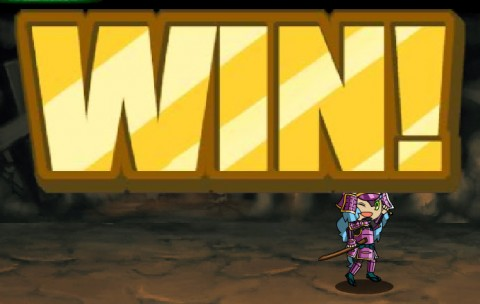
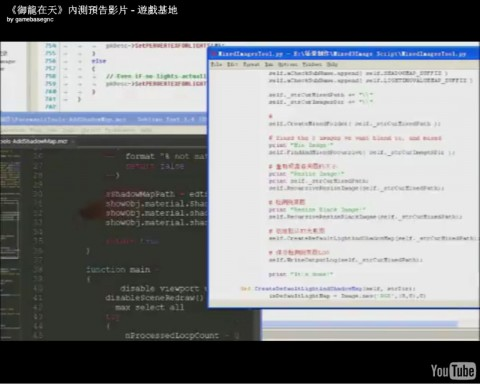

# Daily Blogroll 1/5 - Epic Win edition

If [you want to hear about](http://dragonchasers.com/2011/01/04/rift-the-hook-is-in-the-name/) [the huge controversy](http://forums.riftgame.com/showthread.php?19362-One-hour-beta-impression) over [Jef Reahard's one hour dismissal of Rift](http://massively.joystiq.com/2011/01/04/rift-beta-events-impressions-from-the-staff/), well, [I've already said all I'm going to say about it](../index.php/2011/01/04/1-hour-review-of-your-life/). There's lots of MMOs, like [Kung FOO](http://foo.perfectworld.com/), [Fists of Fu](http://fistsoffu.outspark.com/landing/007), and [Mabinogi](http://mabinogi.nexon.net/) that I played for an hour or two and felt no attachment. If someone had come up to me and asked me how I felt about those games after that hour or two playing them, I'd have told them what I thought.

Anyway, what I wanted to talk about on this first blogroll of the new year is: what makes an MMO polished? A [comment on one of Beau's posts on Facebook](http://www.facebook.com/spouseaggro/posts/130153673714641) (warning: link goes to Facebook) turned into a discussion between me and a person who probably won't friend me now that, among other things, a serious, polished MMO would, or would not, have full voiceovers. 

My view: The more voice-overs you have in your game, the more streamlined the game must be, and the less room players will have to leave the guided tour and strike out on their own. And for me, playing an MMO is all about being set free to live in the MMO's world. While this does mean that I don't consider Star Wars: The Old Republic to be what I would necessarily consider an MMO -- being fully voiced with set paths from start to finish -- that does not mean I don't think it will be a fun online game, because I do. I love Bioware games! It's just that SWTOR isn't what I think of when I think "MMO".

More mucking about in the latest MMO bloggery after the break.

**Massively & Star Trek Online**

[Star Trek Online swept the Massively 2010 Player's Choice Awards](http://massively.joystiq.com/2011/01/03/massivelys-2010-players-choice-awards-results/), winning kudos for Best Launch, Best Crafting, Best PvP, Best Roleplaying, Biggest Surprise Hit, Best Stuffing of the Ballot Box by Rabid Fans, etc etc. Rabid commenters were rabid! But then, they probably didn't bother to vote, either. It's the whole [Bristol Palin](http://www.usatoday.com/life/television/news/2010-11-18-DWTS18_ST_N.htm)/[Kate Gosselin](http://www.thehollywoodgossip.com/2011/01/dancing-with-the-stars-ruined-by-bristol-palin-and-kate-gosselin/) thing -- if you didn't like them, why didn't you vote for the one you DID like?

I'm pretty sure that's the first time either of those moms has been mentioned in a MMO post. I should probably get an award for it.

Ardwulf of the Eponymous Lair [throws some oil on the water](http://ardwulfslair.wordpress.com/2011/01/05/a-look-backward-and-forward/) and points out that 2010 was a really crappy year for new MMO launches, and maybe, just maybe, STO deserved some of this recognition?

**Allods Online**

Kaozz is right there with Ardwulf on the generally crappy quality of 2010's new MMOs. She has a particular beef with Allods Online, which went from being a tasty pastry to dust in the mouth via its cash shop. It's now apparently [advertising itself with animated lesbian elf strippers](http://www.ectmmo.com/2011/01/here-and-now-and-then.html), which inspired Kaozz to write some no-fail rules of success in this crowded MMO market.

**Rift**

Trion World's [announced a release date for Rift](http://www.riftjunkies.com/2011/01/04/rift-release-date-march-1st-2011/), [the full beta schedule](http://www.direct2drive.co.uk/10206/product/Buy-RIFT-Digital-Collector's-Edition-Download), and [opened for pre-orders today](http://forums.riftgame.com/showthread.php?19289-Rift-Pre-Order-FAQ&p=379047).

There's also new details about what this weekend's fourth beta event will include:

> The conflict between the Guardians and Defiants has reached the boiling point as the two player factions finally meet on the battlefield in the biggest and most brutal Rift™ beta event yet … Warfronts! From 10 AM PST on Friday, January 7 to 10 AM PST on Monday, January 10, the Black Garden warfront map is scheduled to be available for play, giving beta participants their first taste of the epic Player-versus-Player gameplay of Trion Worlds’ upcoming MMORPG. In addition to all playable content released during the first three beta events, Warfronts includes a raised level cap to 27, the zones of Gloamwood and Stonefield, and two new dungeons to explore: Darkening Deeps and Deepstrike Mines.

Rift has [a new television ad](http://www.youtube.com/watch?v=yzpnQrUjB14), a montage of title cinematics and a rift being opened, ending with the words "You're not in Azeroth any more". Players are wondering if reminding people of WoW in its advertising [was really a very good idea](http://www.mmorpg.com/discussion2.cfm/thread/302207).

(Thanks to [Rift Junkies](http://www.riftjunkies.com/)!)

**Mind Tricks**

Gordon of We Fly Spitfires notices that while EverQuest took a year of daily play to get to max level while WoW takes considerably less time, once you add in all of WoW's faction grinding and achievement hunting, [the two games are pretty comparable time investment](http://blog.weflyspitfires.com/2011/01/04/do-mmos-purposefully-exploit-human-psychology/). If you don't count the thousands of Alternate Advancement levels you need to earn in EQ, at any rate. He muses that WoW's smaller tasks, but thousands more of them, may have been precisely tuned by psychologists to appeal to humanity's need for mind numbing repetition. 

I don't think you need a shrink for that. Blizzard just watched what players did with their time, and kept putting more of THAT kind of stuff in.

**TERA Online**

What's the perfect game for someone who doesn't care for games like Rift? [TERA Online](http://www.tera-online.com/) might just fit the bill. It's a Korean PvP-oriented sandbox game, which narrows its niche to the approximately three people who will still be playing a month after it launches. Jef Reahard writes about the rumors, written on a Korean fan site, about comments that [might hint at a possible Japanese release sometime this year, with a North American launch to follow at some point](http://massively.joystiq.com/2011/01/04/tera-north-american-release-rumors-abound/).

It's got nekkid ladies!

**Dragon in the Sky**

Epic Hero comes through [with a peek at a video from an upcoming MMO](http://epic-hero.com/news/dragon-in-the-sky-cn-cbt-details/) from China, Dragon in the Sky. It seems to use QTE -- Quick Time Events, where you have to match directions flashed on the screen within a certain time -- as part of its battle mechanic, which is kinda unique. LotRO's Fellowship maneuvers, EQ2's forgotten Heroic Opportunities and FFXI Online's Limit Breaks were like this, but I expect this game makes more use of them.

I wonder if it's at all related to [Dragon Sky](http://www.avault.com/reviews/pc/dragon-sky-pc-review/), a game that came out a couple years ago?

Anyway, the video flashes some pages of code toward the end -- written in 'C', Python and JavaScript -- and who knows why? What an odd thing to include. Maybe it supports modding in those languages, but it's STILL a really odd sight in a promo video.

**X-Fire Sees All, Knows All**

Openedge1 [continues his extrapolation of MMO subscriber numbers](http://simple-n-complex.blogspot.com/2011/01/x-fire-game-got-math.html) based on the number of players of those MMOs that record their time with the X-Fire plugin. Unfortunately, his approach isn't mathematically sound -- you can't generate a curve with only two data points -- which makes the conclusions meaningless, comparisons to Neilsen ratings aside. He acknowledges that the WoW business model differs significantly from the STO business model (it's doubtful many Asian WoW players use the X-Fire plugin though they are the largest segment of WoW's player-base, while it's unlikely there are many Asian STO players at all) and yet...

I guess there's no harm in it. The devs sure aren't feeding us with real numbers.

**World of Wavecraft**

[Via Rock Paper Shotgun](http://www.rockpapershotgun.com/2011/01/04/more-kinectyhacks-world-of-wavecraft/), some researchers have written a software package called FAAST that allows off-the-shelf Windows programs to be controlled with a Kinect controller. Like, say, just for an example, World of Warcraft. Walking is done by leaning in the direction you want to go. Find a dungeon and burn some calories...

[The PC is getting its own Kinect-like controller](http://kotaku.com/5723755/ces-2011-brings-us-the-first-of-the-kinect-clones-for-pc), built by the same people who make the XBox version for Microsoft. They're calling it the "WAVI Xtion". I don't know how it's pronounced. I asked in Twitter and got all sorts of responses; the best was "wave ikshun". I guess. If a kid wants their parents to buy them one, I advise them to just find it in Amazon and point.

**Wurm Online**

Sente from A Ding World [tours Wurm Online](http://adingworld.wordpress.com/2011/01/03/space-wurm-villains/) in his New Year's post covering his recent gaming. I keep HEARING about the game, but this is the first time I've actually SEEN it. Looks pretty cool -- like A Tale in the Desert, Second Life and, more relevantly, Minecraft, everything in the game has been constructed by someone. Which is just amazing.

**APB Reloaded**

[The second coming of APB](http://www.gameinformer.com/b/news/archive/2011/01/03/apb-reloaded-in-beta-form-next-month.aspx) arrives in a new beta next month. The GTA-like MMO had a famously disastrous launch and a cancellation that brought down the company earlier this year, but now it's back. 

I'm no fan of crime and butchery games, but I hope it does relaunch and that it does well because **variety makes for a healthy genre**. It makes me sad when a MMO that dared to be different fails.

Tired now, must sleep. More mumblings from your Lucent Heart headquarters tomorrow!

