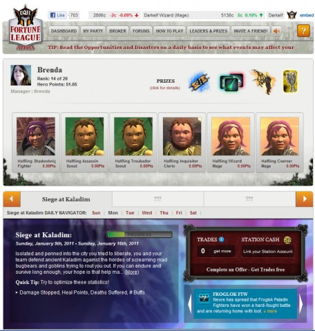

# Fortune League, or, Wall Street Raiders

I was pretty darn excited when I read that SOE was starting up [Fortune League](http://apps.facebook.com/fortuneleague/), a Facebook game based on EverQuest 2, with rewards that would transfer back to your EQ2 characters. You could make just exactly the party you wanted, participate in raids and generally the best parts of your EQ2 experience would seamlessly translate to the social media.

Blogfriend [Eliot Lefebvre at Massively wrote](http://massively.joystiq.com/2011/01/07/fortune-league-brings-everquest-ii-into-the-facebook-realm/) that Fortune League was:

> a game in the earliest stage of testing that will let players adventure in Norrath even when they can't log in to the game proper.

That got me really excited about the game! But I could hardly find anything on the website past instructions on how to create a party and buy characters from the broker. After creating your party, the "How to Play" section gives you one final thought to send you on your way:

> Adventure: Maximize your points over the course of the Adventure for additional prizes and bonuses.

O-kay... right there with ya. Let's go adventure. But how? Was this something where I'd press an "Adventure!" button and then get a report on how my party did -- something like [Legends of Zork](http://www.legendsofzork.com/)? (Where I have 258.8M Zorkmids at the time of this writing, through the miracle of compound interest).

Anyway, the Fortune League website said the new raid, Siege at Kaladim, would begin Sunday. I was right there Sunday with my all-evil halfling party, ready to take on the horde of bugbears, hobgoblins and other assorted meanies but I STILL had no idea what to do.

Today I logged in and found I had made some points. Some people had made a LOT of points. Very few had made fewer. Clearly those with a lot of points had figured out what to do and had done it, and those of us who remained clueless were wondering how we got any points at all.

It struck me this evening -- the game wasn't about ADVENTURING. It was about TRADING CHARACTERS. Chattel slavery, really. See, what happens is you build your party and watch the broker -- the broker for characters. You buy low, you sell high, and alerts during the day give you hints on which class/race combos are rising or falling so that you can make informed character trades.

You get a couple of trades free each day, but more than that will cost you Station Cash -- the SOE RMT system.

So, anyway, there ya go. Fortune League isn't about adventuring in Norrath. Fortune League is a stock trading simulation, where your stock is adventurers. You try to maximize your hand, er, party, and at the end of the week, the player with the best hand wins.

