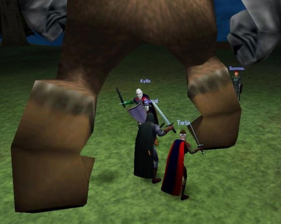

# The MMO Challenge, Revisited.

*I still have lots of good memories from DAoC's beta!*

About three years ago, I was drifting around from MMO to MMO, looking, but never finding, a game that would give me that same feeling of adventure and connection that I'd felt with EverQuest. After thinking for awhile, I had an epiphany; I knew what had changed. It wasn't the games; it wasn't even me. I had then and still have plenty of enthusiasm left for gaming, as much or more than I had in 1999.

The problem was **choice**. There was too much of it. Ultima Online wasn't the first online MMO (not by a long shot), but it was by far the most popular. When EverQuest came along, now you had two serious, state-of-the-art MMOs. MMO gamers either played UO or EQ, and if you hung out in a game store, you'd hear people arguing about them. The success of those two led to Dark Age of Camelot and Asheron's Call soon after, and then things REALLY took off in what I think of as the MMO Bronze Age.

World of Warcraft forced a major reset, outright killing most weaker MMOs and forcing those that remained to heavily retool. Choice was pretty much eliminated. WoW was the game. People who didn't play WoW were fringe gamers.

We're coming into the Golden Age of MMOs. Really, truly, unarguably innovative games are coming out all the time. I'm not talking just about Rift. Wizard101 had a startlingly new battle mechanic hidden beneath the candy-colored graphics. Guild Wars and Star Trek Online explored hireling dynamic.

This year alone sees the launch of Rift, TERA Online (we think), Star Wars: The Old Republic, Lucent Heart and probably Guild Wars 2, all major titles.

And so I come to my MMO Challenge. Three years ago, I realized that to grab back that "my first MMO" feeling, the feeling that made us fans of the genre in the first place, I would have to [choose one single game and stick with it a full year](../index.php/2008/04/07/the-mmo-nostalgia-challenge/).

Since then, I have devoted myself to a bunch of games, some for shorter, some for longer. That very year, I accepted my own challenge and threw myself into Wizard101. I later did the same for EVE Online, Chronicles of Spellborn and Star Trek Online. I might not have gotten a year out of them, but I did get that focus and clarity you get from playing just one MMO.

This year, I am taking up the gauntlet again and plan to devote myself to Rift as my main game, the one I log in to whenever I sit down for gaming. If SWTOR or GW2 comes out, well, cool. But they will just have to wait. You can't immerse yourself in two MMOs.

I'll still play Sunday night DDO, and the STO feature episodes. But most nights, I'll be exploring Telara.

Now, I'm passing on this challenge to my reader(s?). Pick one of the new MMOs coming out this year, or any MMO you have not yet played but think you would enjoy, and just make that your main MMO for an entire year. You will make friends and memories. You will see everything in the game and get a unique perspective that people who dabble can never have.

If you do this, and have a blog, write up your adventures! Even really popular games are new when a new player plays them. If you don't have a blog, consider making one (really easy!) and send me the URL so I can read about your experiences!

[Syncaine of Hardcore Casual](http://syncaine.wordpress.com/) is the master of this kind of challenge. With his laser focus on PvP games like Darkfall and now strategy games League of Legends, Mount & Blade: Warband, he halfway gets me to buying and playing games I'd have thought I had no interest in. I know I'm always going to get a great story when I go to his site.

[Saylah of Mystic Worlds](http://notadiary.typepad.com/mysticworlds/) is that same kind of writer. I first got hooked on her WoW adventures, stuck with her through Runes of Magic, Wizard101, EVE Online and now Rift, and every time it was an amazing read.

[Stingite at The Friendly Necromancer](http://thefriendlynecromancer.blogspot.com/) does this sort of thing so well, he's right at the center of the Wizard101 community, always finding new and clever ways to play. Most recently playing through the game without any gear -- just to prove a point that skill and strategy trump expensive clothing and jewelry.

You can dabble in a half dozen games and never make an impression -- or you can be like these fine bloggers and make a commitment and some memories. If you're thinking about trying a new MMO out anyway, why not make a decision to make it your ONLY MMO until you've wrung everything you possibly can out of it?

