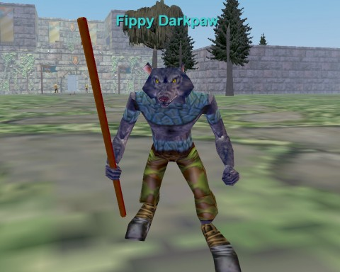

# EverQuest: Fippy Darkpaw NEEDS YOU!

*Posted by Tipa on 2011-01-12 07:18:38*

> BBBBAAAARRRRRKKKK!!!! You humans will pay for ruining our homeland!!! GRRRRRRRR!!!!! Fippy Darkpaw of the Sabertooth Clan will slay you all! BARK!

This is what YOU could be hearing in a few short months! Long before [Hogger](http://www.wowhead.com/npc=448/hogger) ever thought about terrorizing Elwynn Forest, [Fippy Darkpaw](http://www.fippy.net/eq/fippy.php) was em-BARK-ing on his one gnoll crusade against the heavily armored, much higher level Qeynos guards in EverQuest. When I took this screenshot of him this morning, the zone was empty. It won't be empty long.

EverQuest will be [opening a new server come this March](http://eqplayers.station.sony.com/news_article.vm?id=52135). It's looking like [it will be named after one of EverQuest's most famous mobs](http://forums.station.sony.com/eq/posts/list.m?topic_id=172490), Fippy himself.

The new server will take players back to 1999 -- no expansions, no transfers in or out, none of the little helpers that SOE has put in to help boost people to high level in as short a time as possible. Corpse runs? Back in. Death waiting around every corner? Back in. The need to be part of a community to progress? Back in, we think.

SOE hasn't finalized the specific rule set yet, but they claim they'll release the details once the server is officially named.

They last opened progression servers several years back, two of them, and expansion were opened by players as they completed certain specified tasks. When the servers caught up to the present day, they were folded into the regular server communities.

If you have EVER said, gosh, I'd like to go back and relive those great times when games were exciting, or if you missed out on EverQuest and always wondered what it would be like to play the game when there were thousands of other people around with whom to adventure and raid -- this is your chance, maybe your LAST chance.

So, [vote for the server name](http://forums.station.sony.com/eq/posts/list.m?topic_id=172490), and clear your calendar for about six months starting in March. This could be your last chance to experience EQ from the start.

