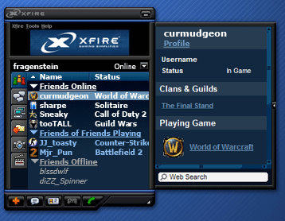

# So who is this XFire person, anyway?

Xfire is a background program for gamers that provides basic matchmaking for some games, instant messaging, the ability to capture audio, screen shots and movies while gaming and track WoW achievements and time spent gaming. According to its home page, it has nearly 18 million registered users (which is not the same as active or current users). 121,602 gamers are logged in at the time I am writing this.

In the absence of any firm active player numbers from MMO devs, bloggers such as [Ardwulf](http://ardwulfslair.wordpress.com/tag/xfire/) and [the blogger known as Elementalistly](http://simple-n-complex.blogspot.com/search/label/XFire) have been using XFire to estimate the number of people who log in to play.

XFire was [acquired last year by Titan Gaming](http://techcrunch.com/2010/08/02/exclusive-titan-gaming-takes-xfire-off-viacoms-hands/), who paid Viacom $1 million for the rights to the XFire name and assets, though not the developers. Viacom had purchased XFire from the original developers in 2006 for $106 million.

Some of [the developers had left XFire to develop competing network Raptr](http://mountainview.patch.com/articles/startup-spotlight-raptr-the-call-of-gamers), including the founder, Dennis "Thresh" Fong.

While XFire tracks many games, it doesn't track Flash games. Raptr does (for instance, Call of Duty Ops is the #1 game on Raptr, followed by WoW and CityVille).

While Raptr has taken up the mantle of the gamer IM of choice, XFire has gone into a little different direction -- as [a platform for pay-to-play online arcade games](http://venturebeat.com/2010/12/08/born-again-startup-xfire-goes-full-circle-with-skill-based-game-wagering-on-xfire-arcade/).

Playing one of the XFire arcade games requires you [to spend XCoins](http://www.xfire.com/arcade/more_coins/), a cash shop currency that you can earn by winning tournaments, watching advertisements from partners, or buying outright. XFire also [runs contests on Twitter](http://twitter.com/#!/xfiregaming) which can earn you XCoins if you're lucky.

Which platform to support -- Raptr or XFire -- or even whether to support either one, is of course up to the player. I moved to Raptr when XFire was reborn last fall because I preferred the better game tracking, and the Raptr IM client could also connect with my friends still using XFire; the reverse isn't true.

While Raptr continues to emphasize its social networking base, XFire is moving toward a games hosting platform. Two different directions, and I wish them both the best of luck.
