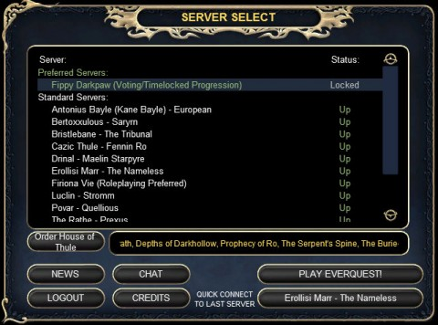

# EQ: Fippy, Fippy wherefore art thou, Fippy

Fippy Darkpaw isn't quite live yet, but he's in the server list. And as I scrolled -- yes, this list is so long that it scrolls -- through the list, it struck me how a near-twelve year old MMORPG has fifteen servers, one opening this very day, while far newer games like Vanguard and Warhammer Online are down to ~~one or two~~ far fewer.

The game designers for every new MMO can probably recite page after page of EverQuest's flaws. And yet EQ is still going strong while new games come and go.

Maybe they're doing something right?

