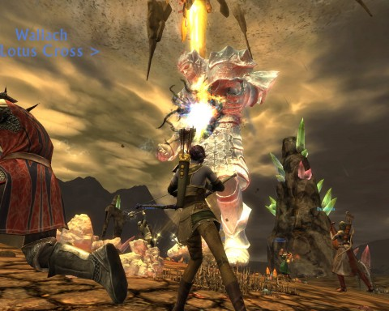

# Unapologetic about this Rift screenshot

I'm trying not to go on and on about Rift; in fact I have decided to hardly mention it at all. It's one thing if it's a game few people play, but that's not Rift's problem.

HOWEVER....

Just wanted to share this screenshot of my Bard/Ranger/Assassin taking down the boss of an earth rift in the Stonefields. Yummy.

I love getting all cinematic on stuff.

Sorry for the Twitter spam...

My character, Dina, is nearly level 17 and really had no business being in the Stonefields. I just got bored with questing and rifting and wanted to explore. I didn't know you could get kicked from public raids, but apparently you can -- as soon as people saw my level, out I went. I did manage to stay in a two-group raid for this guy, though. Did well enough that I earned me a level 19 green tunic.

But since, as I said, I AM doing a lot of rifting, I'm mostly wearing planar reward gear ANYWAY, and my bow is planar as well, so the tunic that dropped is just Auction House fodder.

The guild I joined is still friendly. I haven't grouped with anyone yet, aside from public raids for Rifts and a couple of times I forced myself into a group when someone was camping a spawn. One guy was so confused when I popped into his group -- confused, and with little command of English. "WHAT U DO WHAT WHAT WHAT".

Every rifting rogue has some ranger. Pets running all around.

Running rifty ranger rogues
with their little ranger hogs
jump and shoot and run and scatter
WHAT U DO WHAT IS THE MATTER????

