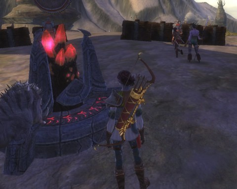
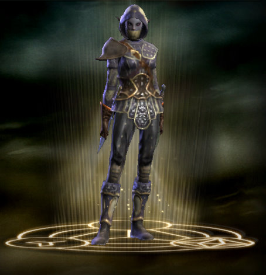
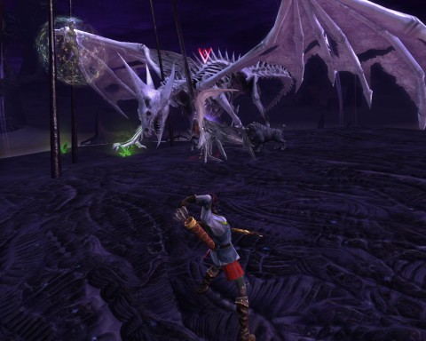

# Rift vs Sliced Bread: A one month retrospective.

*Posted by Tipa on 2011-04-14 07:22:22*

[caption id="attachment\_6336" align="aligncenter" width="480" caption="Harlan's Vista"][/caption]

Rift's "Droughtlands" is the kind of land only a wily coyote could love, filled with dead-end canyons and high, high mesas. Harlan's Vista rises from a sticky sea of tar and rifts. On the very top is an ancient wardstone. I was doing quests around the Vista and noticed that the wardstone -- far above me -- was taken by the Guardians. As a good Defiant, once I'd finished my tasks on the ground, I scouted the twisty, mobby path up, found the wardstone and got an achievement! Yay! A picture was duly taken of this momentous moment and sent out through Twitter, where it was ignored by everyone. Some followers may have unfollowed me at that time.

The wardstone was guarded by a single Guardian NPC. I killed the NPC, destroyed the wardstone, and when it popped back up in a minute as a neutral wardstone, I claimed it for the Defiants. A low level Guardian NPC duly popped out to guard the wardstone as ineffectually as its Guardian counterpart. But it ALSO triggered a local public quest, "Never Say Nether", which promised to fortify the Defiant position on Harlan's Vista if I gathered twelve bits of nether energy from the base of the mesa. A helpful teleport circle would give me quick access to the base without having to fight my way up and down.

No instructions on where the energy was or how to collect it. After bumbling around for a bit, I figured out that I was supposed to walk into one of the wispy balls of light in the tar pits, which would turn me into a wisp that was non-aggro to all the shadow critters and other NPCs, then take the teleport circle back to the Vista, walk into the wardstone to deposit the energy. Repeat twelve times. After a few rounds of this, another Defiant started helping, and together we filled the wardstone up. The Defiant outpost then respawned with more NPCs, some barricades and a special Rare Planar Goods vendor.

This is Rift at its strongest, when it departs from the status quo and sends a little bundle of fun your way. There were a bunch of quests for that same area, but I don't remember any of them (I know I had to kill stuff). But that "Never say Nether" one -- that stuck with me.

[caption id="attachment\_6337" align="aligncenter" width="454" caption="Dina the Rogue"][/caption]

More than a month in, and I still haven't hit max level. I just haven't had as much time to play as I'd have liked. I'm a level 47 rogue, and have done all the normal dungeon instances except Realm of the Fae (newbie Guardian instance) and Charmer's Caldera. I did Abyssal Precipice last night for the first time, even though I was a level or two too low and entirely unprepared. That got me my first couple bits of gear I'll need (including a dagger with the necessary HIT stat) when I hit 50 to start on the Expert T1 dungeons, which prepare you for the Expert T2 dungeons, which prepare you for raids.

I was lucky to get that group. I am a slow leveler. A month to max level IS slow in Rift. I am being lapped in the guild by peoples alts. My guild has zoomed past me and have been in T1 Experts for awhile. In the midlevel zones in which I adventure, it's hard to find enough people in the same area to take down the persistent elite rifts. You can't do those with just two or three people and there never seems to be a critical mass unless there's a full on invasion, which focuses players and allows a raid capable of clearing major rifts to form. And THEN everything swims along nicely.

When I started my character, I leveled her balanced as both bard and ranger. When I got into my twenties, I shunted the bard into its own spec and moved the ranger into a secondary soloing spec. I figured out the macro system in the thirties and was able to successfully meld ranged and melee abilities so that they would trigger with the same key presses depending on the range to the mob, basically turning the now ranger/assassin into a one-key ability spamming machine. (One key for the spam combo builders and reaction abilities, the others a wide range of situational special moves and finishers).

I decided a couple days ago to come up with a pure melee/stealth build. I spent a few hours in the ZAM Soul Builder, read through the forums for advice, and came up with a pretty decent assassin/bladedancer/riftstalker build that combines devastating damage with some self-heals and good defense.

This would have been three entirely separate and distinct classes in EverQuest II -- a troubadour, a ranger and a swashbuckler would be the closest analogues. World of Warcraft doesn't even have a support rogue class like the bard. It really seems like I have three different characters in my back pocket when looking for dungeon groups.

I joined the Abyssal Precipice group last night in my melee dps spec (my roles are: bard, melee dps, ranged dps, and this is how I advertise). Seeing my relatively low level, a higher level bard in the group suggested I take the bard slot and he would shift to dps. We both shifted specs and breezed through the dungeon in our new roles.

This, again, is Rift at its strongest. It's not quite yet to the level of "bring the player, not the class", but it's closer than many games.

[caption id="attachment\_6338" align="aligncenter" width="480" caption="A River of Souls event rift"][/caption]

Dynamic events and the soul mechanic are Rift's bread and butter. There's room for improvement in the other areas.

Dungeons: the dungeons are fun, yes, but are tuned for such a narrow level range that most dungeons you can run only a couple of times before they just have nothing for you any more. Since a player even a level too high can breeze through a dungeon and get no xp from anything except the reward for finishing the instance quest, it is difficult to effectively build groups the further along you get. I've gone along on lower level dungeon runs just to see the places again, but the game did nothing to reward me for that.

EverQuest II started, a couple expansions ago, tuning the instanced dungeons to the levels of the players. They ALSO have a mechanic that lets players temporarily drop their level to the level of another player in the group, and they will get xp and other rewards commensurate with this level. Doing a lower level instance dungeon in EQ2 in this way still gives players rewards for helping lower level players out. I really miss this in Rift.

If all I did in Rift were the rifts themselves and dungeons, I'd have no complaints. But where it seemed in beta and when I was lower level that I could get through the game just via rifts and dungeons, that's evaporated as the player base spreads out. I had to turn back to questing as my main method of gathering experience.

It's just the same old, same old. Collect quests at a quest hub. Follow the map markings and click on the sparklies or kill what it tells you to kill. Return for the reward. I hate the artificial quest mechanic, which has as its only purpose giving you something to do when you can't do something fun. I say I don't, but I really usually do read the quest text, and the quest writers have obviously tried their best to fit bits and pieces of lore where they can. I now know why the Golden Maw hates the Storm Legion. Me, I hate them both and kill them when I can because I am a stone cold killer. The only real fun is trying to kill them in different ways.

I really like Rift, I do. But then, I really liked World of Warcraft, too. I was an absolute fanatic about that game for a long time. Thing is, I've DONE WoW. All I want from Rift is stuff I couldn't do in WoW. I've already forgotten most every WoW quest, long ago. I will have no recollection of any Rift quest I've done more than a day ago. They are empty experiences no matter the game.

Cloning EQ2's mentoring system would be a great improvement -- or they could come up with another way that players of all levels could work together. When Rift releases its first expansion, I hope they find some way to work the quest system so that there's fun involved.

Am I unhappy that I chose to spend my time in Rift vs, perhaps, EQ's new progression server or one of the other new MMOs? Not at all. But I did think it would be more fun, all the way through. That was naive of me. Underneath it all, Rift is much the same animal as WoW, something that couldn't escape anyone's notice from their first moment in the game. It's the same sort of brainless, autopilot fun as WoW, and it isn't as innovative as it wants to be.

However, this is JUST a month in. Where Rift takes a chance and departs from the norm, it shines. Rifts and soul tweaking are genuinely fun innovations. The dungeons and quests are generally non-dynamic, though well-polished. Still, why borrow from WoW when you could do something new?

Rift had a great launch, but if it wants to become legendary, it will have to take even more chances and craft something truly unique.

