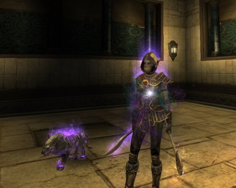

# Rift: Ding 50!

*Posted by Tipa on 2011-04-17 19:47:51*

[caption id="attachment\_6355" align="aligncenter" width="480" caption="Couldn't get more glowy"][/caption]

Lucked into a group grinding the Abyssal Precipice instance and dinged 50 a few times in. So, I'm now max level in Rift. More than that, I have the required, for rogues, +HIT > 50 (mine is around 75), so I am geared sufficiently for T1 dungeons. In T1 dungeons, I need to work HIT to > 100, and then in T2 dungeons, to > 200 for raiding.

It's all so very EQ2 and WoW like. But here's the thing -- I never really did the whole gear progression thing in EQ2 and I never did it at all in WoW, so this gearing for the next tier up thing is foreign to me. In previous games -- EQ, and EQ2 before they made it like WoW -- I just went straight from leveling to raiding and just got raid gear.

Most other MMOs I lose interest in well before it gets to raiding, so kudos to Rift for keeping me invested in the character.

Hitting 50 leaves me halfway through the Shimmersand quests, and not started at all on the Iron Pine Peak or Stillmoor quests. The main reason to continue doing these quests is mainly to just get the story of the zones, get achievements and to build faction to buy crafting recipes.

Or I could begin to level my alt, which is the path a lot of people choose. But maybe the expert dungeons will be fun enough to do on their own merits; they are also great places for faction.

But at least the leveling is done. For now. Even though it hasn't been all that long, the lowbie zones seem like years ago. Stonefields seems like ancient history, even though I know I was there for what seemed like forever. The leveling ramped up speed after that, and only slowed down in the long haul through the 40s.

Anyway, see ya in T1!

