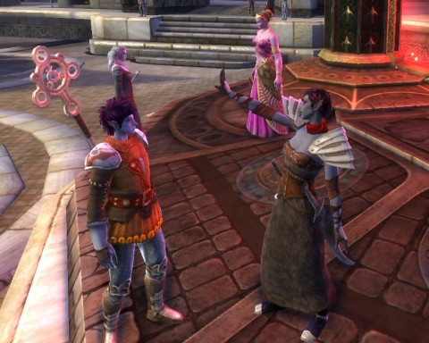

# Rift: Tier 2

[caption id="attachment\_6378" align="aligncenter" width="480" caption="If you really want to keep it, put a ring on it"][/caption]

That's [the amazing Stingite](http://rift.happydueling.com/) and I admiring each other's fashion sense. Because that's what these games really are, when you get right down to it -- Barbie dolls for adults, right?

Things are busy at work, but not as grueling as recently, might just be about time to start up with the blogging again. But, tonight, just want to update on my Rift progress. Which may be dull, but I vowed to play Rift as my main MMO for at least six months, so for news of what I play -- it's Rift, and not much else.

Well, my guild leader on Godville wants me to play more.

Anyway. After (apparently) beating the necessary stats for queuing for T2 dungeons for some time now, looting a sword pushed me over whatever barrier I hadn't been clearing. Nonetheless, the only dungeons I managed to get via the looking for dungeon tool were T1 dungeons.

I hadn't had much luck finishing Expert King's Breach, with the spiky room at the end, so when we drew that dungeon tonight I kinda groaned inside. But I was with a great group of puggers who had no problem with wearing our soul vitality down to zero, healing up and working it down again until we learned the moves and -- there we go, we finished it up, and my last T1 dungeon was completed.

My wonderful guild offered to take me along on a T2 dungeon, Expert Abyssal Precipice, and of course I leaped at the chance. Every fight was explained, we had a couple wipes but nothing serious, got a new tunic (the dress my character is wearing in the picture) and enough plaques to buy some ENORMOUS shoulderpads (also being worn). Runed them both for +20 more dex, and had previously runed my weapons for +30 more, so that's a +50 rise in dex in one day. Still need to work on the +hit.

I haven't yet raided with my guild. I am still hoping to get my +hit above 160, but I have a long ways to go.

Nonetheless, Rift is still pretty engaging. I think logging in with a definite plan is not the best way to approach the game; I log in and start doing whatever occurs to me, and by the end of the night things have gotten done, but they are rarely what I set out to do. Spent a fun couple of hours fighting a new kind of water invasion in Iron Pine Peaks, where our initial small force was totally being steamrolled by the mobs, but we regrouped and managed to hold them off right at our last bulwark.

Something always seems to be happening.

