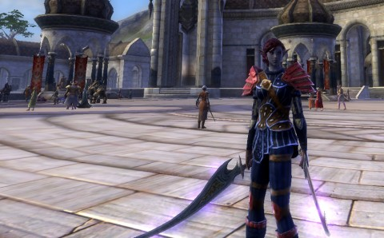

# Rift: The Expansion Trap

[caption id="attachment\_6381" align="aligncenter" width="480" caption="Chillaxin' in Meridian"][/caption]

Every time I post, my character is wearing a new outfit. It's a compulsion! I can't help it. But this outfit is special -- it's T1/P2 complete. Everything comes from either Tier 1 expert dungeons, or Prestige 2 PvP gear vendors. The gear from T1 and P1/2 are roughly equivalent. I spent Saturday chaining warfronts to get to Prestige 2 expressly to get that tunic. Afterward the guild (and I) raided Greenscale Blight where we easily took down the duke and got the interrogator (or whatever the next boss is called) to 17%. I was asked to switch to bard spec, which is raid code for "your DPS sucks, play these songs and try to stay out of the way". But that's okay.

Rift is fun, but I'm missing the excitement. It's easy to dismiss raiding as a waste of time, since when Rift releases an expansion, the level cap will likely rise, and all this hard-won gear will be instantly useless. (Thus my new idea for raid loot, once I become eligible to loot, which is to pass on everything and get nothing and save the DKP for when it matters -- next expansion. Or the expansion after that.) Raiding for loot is trading time for pixels. The real purpose of raiding is to build a community among the guild -- shared struggle and victories, bring people together, you know upon whom you can depend, that sort of thing. Boot camp for gamers.

I've been a raider in EverQuest, Dark Age of Camelot (well, keep sieger), World of Warcraft, EverQuest II and now, this last week, in Rift as well. It all feels very much the same from one game to another. Rift is already falling into the expansion trap. They announced a new high level dungeon for those raiders who finished all the previous high level dungeons. Non-raiders have T2 dungeons and likely soon T3+ dungeons to do. Expert and raid rifts give the pickup group contingent things to look forward to. But...

Once a MMO embarks upon the "new expansion, gear reset, more love for raiders" road, the danger is that the game becomes so linear and focused on the end game that players new to the game may feel they can never catch up -- and that even if they have the desire, the largely unpopulated lands between them and the bulk of the playerbase could be very discouraging.

MMOs need to become wider as they age. EverQuest substantially widened their game with entirely new leveling paths and races and even classes with the Kunark, Luclin and Serpent's Spine expansions, as well as adding game-changing content for every level with Lost Dungeons of Norrath, and Depths of Darkhollow etc. But even that game now struggles beneath the weight of 90 regular levels and usually desired 1000+ alternate advancement levels, with complete gear resets every ten levels. WoW and EQ2 fall right into line, though WoW, with a super-accelerated leveling curve and no AA levels, at least provides few barriers for a new player trying to join friends at the end-game.

Still, there's no reason Rift needs to go that route, and I'm hoping they don't. Here's some things I'd like to see instead of ten more levels and a gear reset.

**A Third Faction**

Two factions forces an "us vs. them" attitude, which is easy. It's boring. DAoC had the "you and me against them!" attitude, where "you" and "me" shifted with the tides of war. That was exciting. Rift has lots of places you could fit a third faction; there's The Endless, the followers of Regulos working for the destruction of the world -- that would be my pick. Maybe there could be some sort of refugee faction, where Guardian and Defiant Ascended decide to set aside their battle against each other and unite to save the world. Or since we now have rifts that open to parallel worlds where the conflict is already won or lost, why not explore these places?

Problem is, if anyone can claim there is a story behind Rift's conflict, this is a conflict that is going to have to be resolved at some point. Wouldn't it be fun if the first expansion came out, and the dragon war was over, the Ascended won it after all, and now something new happens -- a new chapter in the story?

**New Souls**

This isn't stretching. Any Rift expansion will add new souls. The alternative is adding more soul points, and that would just make characters too powerful, requiring widespread nerfing and rebalancing and just angering players.

Telara is a patchwork land. It's not crazy to think that there's other, forgotten countries where the people are making their own stand against the planes, in ways unique to them. The souls that come from those lands don't mix with the souls we know. These strange new techniques are very effective against the creatures of the new lands, whereas the ones we have today don't work quite so well. So everyone will have to acquire some new souls if they want to travel to the new lands -- and the people of those lands will have to change their ways when they visit Meridian and Sanctum.

**Builders**

When EQ2 launched, crafting was a separate but equal path of advancement to adventuring. As you leveled crafting, you accessed the same higher level chat channels as adventurers, gained access to the same higher level zones, and so on. In Vanguard, crafters can build homes and ships you can leave in the world. Ultima Online and Star Wars Galaxies had that as well. The real world is full of builders; people love building things! Minecraft, Sim City, even Farmville offer builders a chance to play. Dark Age of Camelot relied upon its siege engine builders. Horizon tasked crafters with unlocking new races.

Destruction is easy. Building is hard.

I'm not talking about building bridges, train tracks, new cities, ships that sail the seas and trades to be done with the people at these far off lands. I'm talking about... hey, wait. Those ARE all the things I want to see. Give me a place to build and something to build there, and now I have something worth fighting for. Enfranchise me, Trion!

Guild halls a la EQ2 are a good start. EQ2's best guilds prize their interior decorators. A well put-together guild hall is a testament to the guild. Vanguard's are better, since they are in the world and not instanced. I'd like to see Rift's take. In Rift, characters walk right through each other, they don't touch the world, they leave no mark. Let's leave a mark.

