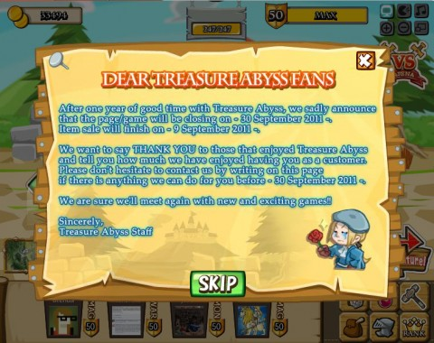

# Treasure Abyss closes its dungeons

[caption id="attachment\_6542" align="aligncenter" width="480" caption="Treasure Abyss' goodbye message"][/caption]

I was on a quest last year for a Facebook game that was really a *game*, especially some sort of RPG. The great thing about Facebook games is that there are so \_many\_ of them, that there's bound to be a couple that appeal.

I fell pretty hard for Treasure Abyss, a whimsical RPG from gaming giant Namco Bandai that let you create a party formed from your character and those of your friends and kill dragons and other stuff. I sunk a lot of time and a fair bit of money into the game. I don't mind paying for games if I'm having fun.

After awhile, I moved on and so did Namco Bandai. Treasure Abyss development slowed; in the time since I stopped playing six months or so ago, they have added just one dungeon, a very short dungeon meant for new players. One new (hideously expensive) set of armor that can be worn by all classes, a couple new magician weapons and a daily lottery spin.

Even the most casual player would long have completed and left the game. Still, it's sad to see it close down.

> Dear Treasure Abyss Fans

After one year of good time with Treasure Abyss, we sadly announce that the page/game will be closing 30 September 2011. Item sale will finish on 9 September 2011.

We want to say THANK YOU to those who enjoyed Treasure Abyss and tell you how much we have enjoyed having you as a customer. Please don't hesitate to contact us by writing on this page if there is anything we can do for you before 30 September 2011. 

We are sure we'll meet again with new and exciting games!!

Sincerely,
Treasure Abyss Staff

