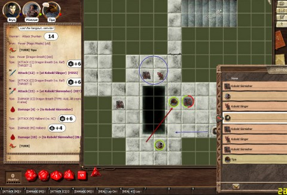

# D&D: Kobold Seasoning

[caption id="attachment\_6545" align="aligncenter" width="480" caption="A tense encounter..."][/caption]

We'd been framed for crimes we did not commit, were thrown into jail, broke out, tracked down a crime boss to a tavern and beat the crap out of a halfling. 

The day was starting off swell.

While our elven cleric, Sheeoil, was off dealing with some ecclesiastical emergency, the rest of us were asked by the local lord to see about a minor kobold problem... he's sent the guard, but they apparently don't return. There seems to be some darker power behind the kobolds... and wouldn't we really be having more fun AWAY from the local tavernry? Of course we would!

We were three -- the human wizard Bryn, the halfling thief Wenner (not the one we pulped back in the town), and me, Tipa Redscale, a dragonborn paladin of Bahamut.

The basement beneath the tower ruins seemed promising. And dark. We lit torches and sent the halfling to scout ahead. A kobold, bleary-eyed, shot out of the darkness! Wenner deftly knocked him into a pit of slime, Bryn roasted him with a magic missile, and I sealed the deal by mincing it with my halberd.

This was going to be EASY.

One more kobold ran screaming out of the shadows. We heard an iron grate raise, and three more came from some deeper level.

This was NOT going to be so easy.

Hours later (real time), three of the kobolds were dead, one escaped, bleeding, back below, Wenner had danced with death and bounced a few shurikens off the walls, hoping for deadly ricochet damage; Bryn had explained to the kobolds everything he knew about magic missiles; and my halberd was well-sanctified in kobold blood. Plus, I got to grope the halfling.

Not as much fun as it sounds.

---

Last night we finally got to use all the tools we've been learning to use -- Google+ hangout, Fantasy Grounds virtual tabletop, and DM Chris had found a cool online tool, [Dungeon Painter](http://pyromancers.com/about-dungeon-painter "Dungeon Painter"), to quickly make nice looking dungeons that could be imported into Fantasy Grounds.

Can't wait for next week :)

