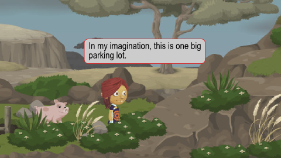
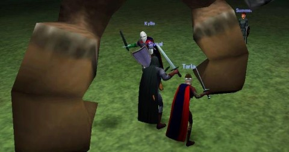
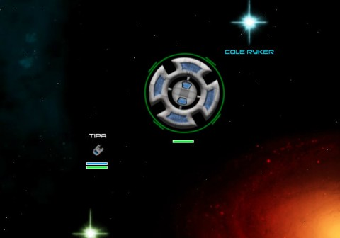
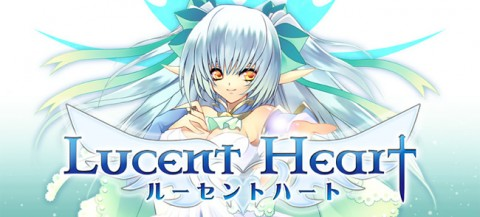

# Daily Blogroll Oct 10: Columbus Day edition

[caption id="attachment\_6549" align="aligncenter" width="480" caption="Creativity can be deadly"][/caption]

I realized today that I have no clue whatsoever what the term "MMO" means anymore. I gave it some thought and came up with "An MMO is an online, real-time game where other people affect can your game." That's pretty vague. Clearly there are games which call themselves MMOs and can be played as if they were MMOs, or as if they were solo RPGs. I don't know. I just know the old definitions don't work.

Take World of Warcraft and the current flavor of the month, Tiny Speck's [Glitch](http://glitch.com "Glitch"). One is the most popular MMO in the world (well, if you don't include [World of Tanks](http://game.worldoftanks.com/about "About World of Tanks"), though the developer does). The other is a super casual browser-based game where you can't even kill stuff. The two games share almost no features, yet both are MMOs. I give up. If you can play your game and can see another player when you do so, it's a MMO.

Which is going to make writing these Daily Blogrolls SO EASY. Checkers? Is it online? MMO.

The blogging world has changed quite a lot since the last time I was doing these (and work crushed my free time). People are leaving drops of content all over the Internet, on Tumblr blogs, on Google+, on Twitter. I'll still be pointing out great posts by the bloggers in my blogroll, but I'll be trying to collect some of these other far-flung bits of wisdom as well.

Before I get started, an update on my MMO gaming: DDO on Sunday nights, D&D fourth edition on Thursday nights, and Glitch. Driver issues have killed EQ2 -- I can't play it. I've been poking around in Rift. I've started working on the Saint's Haven quests in Dragon Nest. [Mostly Glitch](https://plus.google.com/108460561201888322767/posts/JmCoShk3siV) for MMOs, though.

Beau Turkey has done [a heck of a write-up](http://massively.joystiq.com/2011/10/09/rise-and-shiny-recap-glitch/) on Glitch, btw.

[caption id="attachment\_6551" align="aligncenter" width="480" caption="Fighting giants in DAoC beta"][/caption]

It's been ten years since Dark Age of Camelot went live? Wow. I remember calling it "EQ Lite" based solely on the screenshots they released in the early rounds of beta. When I got into the beta myself, I realized just how impressive an achievement the game was. Yes, it clearly had been influenced by EverQuest, but it was its own game and would become one of the influences that would form the mechanics behind World of Warcraft.

It would be physically impossible for anyone to spend more time in a game [than I spent in DAoC](../daoc/). Scott Jennings, Mythic's one time DBA, [has a wonderful post from Matt Firor](http://www.brokentoys.org/2011/10/09/a-decade-of-camelot/), DAoC's original producer, one what it was like to ship an MMO before the market was crowded with hundreds of them.

It was a different world.

[caption id="attachment\_6552" align="aligncenter" width="480" caption="Star Corsairs"][/caption]

After taking the world by storm with his sandbox browser MMO [Golemizer](http://www.golemizer.com/), indie MMO dev Dave Toulouse is set to unleash his second game, [Star Corsairs](http://www.starcorsairs.com/ "Star Corsairs"). It's an updated take on the old space exploration / trading games of the 80s (most notably [SunDog](http://en.wikipedia.org/wiki/SunDog:_Frozen_Legacy)) combined with the mining, ship construction and PvP of EVE Online. And maybe a smidgen of [Star Castle](http://en.wikipedia.org/wiki/Star_Castle). Explore, take on missions to protect the Federation, construct your own starship, blow stuff up, free to play. I'll have more on Star Corsairs when I've played it more.

[Donate, and he'll name a star after you](http://www.starcorsairs.com/nameastar.htm).

Speaking of indie MMO development, Andorov posted an excellent list of [15 important steps to wild success in indie MMO development](http://forum.unity3d.com/threads/106750-Top-15-rules-of-successful-indie-MMO-developers).

> Rule 4: Create a good company and MMO name. Recruiting for Joe Schmoe's Awesome MMORPG is going to be a lot more difficult than Excelsior Games' Islandia: The Re-Islanding. Most non-visionaries (which I may also refer to as dumb f**ks or DFs), though talented, are simple folk and easily impressed.

Lucent Heart, the "zodiac-inspired" dating MMO, not content with merely connecting up guys playing guys and guys playing scantily-clad girls, is about to [unleash dance battles upon the world](http://www.anjelsyndicate.org/2011/08/31/lucent-heart-first-expansion-adds-dance-battles/), says Anjel Syndicate.

Create your dance from dozens of dance steps, re-create music videos, and .. well, if a collection of Minstrels can do System of a Down in LotRO, I suppose a bunch of angel-winged schoolgirls can do Thriller in Lucent Heart!

See ya tomorrow!
