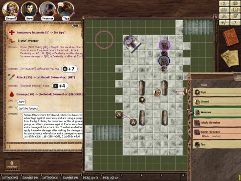

# D&D 4E: It's a trap!

*Posted by Tipa on 2011-10-14 06:44:46*

[caption id="attachment\_6571" align="aligncenter" width="480" caption="Floor 2"][/caption]

If this doesn't look like a tense situation to you, let me describe it better. We're in the basement of a ruined tower; after a pitched battle on the floor above, we descend warily to the floor below, and in the flickering light of some braziers (NOT BRASSIERES, WENNER), see four sarcophagi and three kobold skirmishers guarding an altar to Tiamat, the Ender of Worlds.

I, dragonborn paladin Tipa, roll dead last on initiative, and stand frozen in fear of the crudely-hewn icon of Tiamat as the rest of the Adventure Co spring into action. Halfling thief Wenner and human wizard Bryn do some damage to one of the three kobolds. Elf cleric Sheeoil (whom we'd found unconscious on the stairs) discovers a trap -- click. Sproing. Those braziers are \_armed\_.

The kobolds, alerted, heft their spears and move to attack. Wenner gets some deadly shuriken attacks in while Bryn keeps things heated up with the magic missiles. I'm lumbering slowly into position, as I have no ranged attacks (I'll have to work on that).

The kobolds split up to flank me; I mark one with divine radiance, causing 7 damage to it if it attacks anyone else before my next turn. My halberd rings uselessly on the stone floor as I miss my attack, but I follow up with a puff of acid breath which burns and bloodies it. The other gets an attack of opportunity on me. Wenner sneaks up and hits it for normal + sneak attack damage. It turns to attack Wenner and my Divine Radiance goes off on it. Sheeoil attacks with a spell that grants me a couple extra much needed hit points while damaging the kobold.

The kobold I am attacking starts to run to the stairs leading further down; I pursue and Intimidate it. It cowers beneath dragonborn fury as the others finish off the second kobold.

Question time. We luckily both speak Draconic, and as we question it, it tells us that the kobolds are attacking caravans in order to obtain skulls for the Skull Skull Arena game... on the next floor. It has no other useful information for us.

Wenner, who has been off searching the altar for treasure (and finds 60 gold), comes by and casually sinks a dagger into the poor creature. I restrain myself from eating the halfling right there, and burn two Lay on ~~Hands~~ Claws to bring the kobold back to consciousness. I tell the kobold to go and never come back. It scurries off to the higher levels.

I may have need of those two Lay on Claws in the Skull Skull Arena. Thanks, Wenner. Wenner sheepishly admits that he found ten gold pieces on the altar, and offers to share them.*

Next week: The Game of Skulls.

* no, he didn't actually try to keep more than his share. But he should have!
