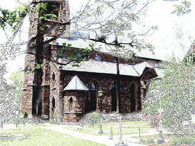
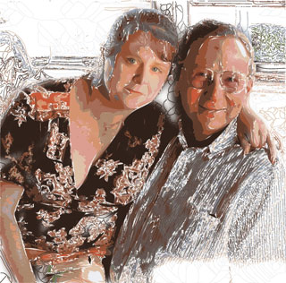
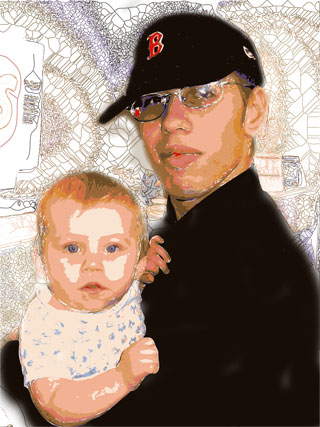

# Playing around with autotrace in Linux

*Posted by Tipa on 2007-09-07 07:41:37*

I've been playing around with the Linux 'autotrace' command -- yesterday's screenshot was a composite of a centerline and blobular tracing of an in-game screenshot.... Thought today I would try it out on some real pictures. (I cheated a little -- I composited the two tracings in Photoshop on Windows. Does that make me evil?)

A church near work. Autotracing rocks for pictures like this.

My sister Jenn and our Uncle Lester. Not as effective, but not bad.

My son Andrew and grandson Matthew. This one doesn't work at all.

I guess this is why I am not a real artist :P I do like the church, though.
