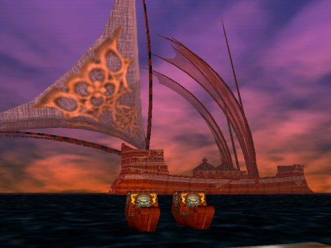
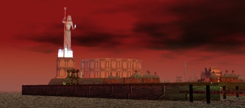
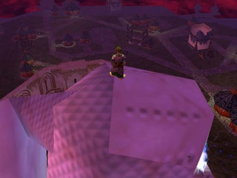
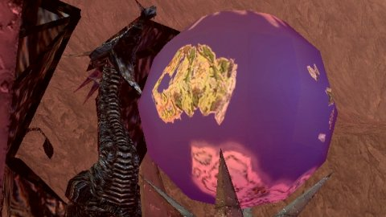

# Remembering Kunark 

*Posted by Tipa on 2007-09-17 22:48:01*

*The Butcherblock shuttles with the ship to Kunark waiting offshore*

They don't have boats in Everquest any more.

I guess it's faster to zip around the world via the Plane of Knowledge, or the translocator gnomes now. Back in the first couple of years of Everquest, you went from place to place in boats. I was late to work the morning Kunark came out, and I was on the first boat out.

These weren't the dinky boats the humans built. These were elven ships of exploration, sweeping and beautiful. Velious would bring clanky gnomish ships. Luclin had spire travel. There were never ships like this in Norrath again.

*The Outpost of Firiona Vie*

The outpost of Firiona Vie. King Tearis Thex was so broken up at his daughter's kidnapping that he invaded Kunark and built this outpost among some old Iksar ruins and built a statue of his daughter two hundred feet high, undefeated, unclimbable...

*Climb to the top of the ruins, float at top speed to the pedestal, climb up the staff, over to her bust, up her shoulders, up the staff some more, float over to her head. Go ahead. Try.*

*Almost* unclimbable... Don't try this unless you have a couple of hours. And levitate. And bind. And SoW. Actually, if you're not a druid, just forget it.

I was only level 30 when Kunark opened. Yeah, I know, I was a slow leveler... but I'd changed mains from my first character, an Erudite wizard, when I discovered other races *weren't* blind half the time. I was perfectly happy in South Karana and nosing my way into the Temple of Cazic-Thule.

Kunark turned EQ from a game I'd play a couple of times a week into one I played nearly every night. There was just so much to do and I thought I could never do it all. I met a lot of friends, many of whom I still hear from now and again.

EQ had problems, every game does. Given how little the EQ devs had to go on, making stuff up as they went along, really, it's amazing how much they got right. And the wrong things, like the way you could die in locked zones (Old Sebilis and Howling Stones) and have to do the access quests all over again, naked, just to get your stuff.

*The globe of Norrath in Skyfire, showing Kunark, Velious, and Timorous Deep.*

