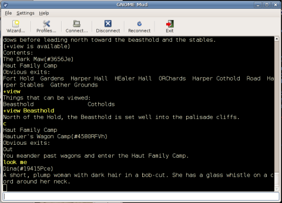
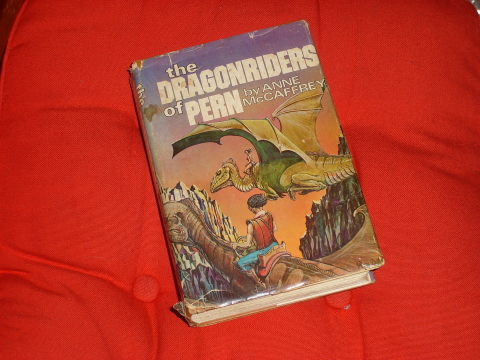

# PernMUSH

*Posted by Tipa on 2007-10-01 07:17:17*

In thinking about how Wiki technology could be extended to make MUDs (text-only **M**ulti-**U**ser **D**ungeon -- these were the MMORPGs of the 80s and 90s), I got wondering if the MUD in which I spent the most time, PernMUSH, was still around...

And what do you know, it's still up.

Anne McCaffrey writes romance novels. They may seem to be fantasy or science fiction (or, in the case of the Pern books, *both*), but what they really are, are romance novels.

*I've read this a dozen times over the past thirty years, Maybe more.*
Pern (to labor the backstory) is a planet, colonized and forgotten in the way things normally are in the future, and everyone was peachy and happy until Thread started falling from the sky -- burning, voracious fungus life from the planet in a severely eccentric orbit that swings by every couple hundred years Turns. (Why not just say *years*?) (Actually, I know the answer to that one. It's so geek girls with stuffed firelizards on their shoulders at SF cons can earnestly roleplay with other fans).

So the colonists bred teleporting, psychic dragons to burn the Thread from the sky. Of course.

Okay, it sounds silly, and maybe it is a little silly, but they are really good stories, and I recommend them to everyone.

PernMUSH brings you to Pern just after the end of the Threadfall that backdrops the first three books. You can go to every place, tame firelizards, ride dragons, learn a craft, build your own room... It's a "worldy" game, there's no points, levels, killing or anything... to be part of a story is the reason to play.

*To get to PernMUSH, telnet (or use a MUD client such as Gnome-MUD) to pern.mccr.org port 4201.*
