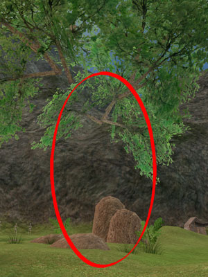

# EQ2: Case of the Missing Tree

Last night we had low raid attendance (and it was lucky I was even there at all -- I'd just woken up from a drugged sleep... stupid toothache...), so the raid leaders decided to have everyone that was on finish up their Roost access.

Roost is an instance in Mystic Lake, part of the Isle of Mara expansion. For such a small expansion, it sure has enough raid targets -- crab, Cheldrak, Matron and Mr. Unpronounceable Name, the four-winged wonder who sits at the end of the shortish Roost instance.

I'd already completed the access quest on Dina, so I got permission to come along as Dera, my inquisitor, since it seems I'm raiding with her about half the time now.

To get the quest, you must have permission to climb to the third level of the monk tower in the Village of Shin. I'd already done the (solo) quests to the second floor, and so I had an hour or so to read more of "Dragonriders of Pern" while waiting for the rest of the group to catch up.

Then we were off to the Forsaken City for a thrilling evening of... finding bookcases... and clicking on them.

No, wait, these were EVIL bookcases, and they do NOT like being clicked upon. Some of them CREAKED MENACINGLY! And at the last bookcase... the books were... they were... they were NOT in alphabetical order!

The horror. The madness.

Tromping through Forsaken City finished one of the quests. The other required summoning a ghost by playing an ancient song on a flute in front of a tomb. Of course, the tomb was guarded by waves and waves of nasties, which we barely survived (monk tank, me the only healer, necro who gave a heart to a brigand over me.... but I'm not bitter.)

With that over, my tooth was hurting again so I drugged myself with a tasty blend of generic ibuprofen and Tylenol PM and went back to bed.

*Following a bird spirit through Mystic Lake*

This morning I did the solo quest that finishes the access -- finding eight birdcages in Mystic Lake and the Village of Shin. One of the birdcages is up a tree... and you have to climb the tree to get to it... problem is, this is a MAGIC tree that has no trunk.

I'm told that from certain angles, if you turn your head a little sideways and squint, you can see the mystery trunk, but I couldn't, no matter what I tried. So I went back to the Village of Shin, checked the Freeport importer, bought some Gnomish Jumping Stilts, restarted the quest and had no trouble. Jumped right to the rocks beneath the cage, grabbed it, got the other cages and then all that was to be done was to follow a bird's spirit to the Roost.

Sure, I'd have gone inside and soloed the four-winged bird guy, but I have a dentist appointment this morning... maybe I'll do it later, with eleven friends or so...

