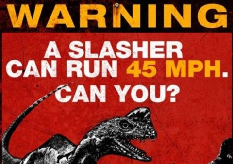

# TV Watch!

Last night I finally got around to watching **Terra Nova**, which had the cop actually do some detecting. The producers had the perfect opportunity to get the annoying teenager and his girlfriend eaten but screwed it up again. I'm hoping they don't wait for the season (series?) finale to make him dino-chow.  
  
Also watched the start of **Glee**. This is a show I love so much, or loved. They had one of the winners of The Glee Project finally show, but the part of the episode I watched was just painfully unfunny stuff about Sue Sylvester trying to kill all the arts programs in Ohio while Elphaba and Mercedes are trying to recruit the girls from the Glee club to form a rival club. This show may have lost its core of friendship and good humor forever. Well, it was a good two years.  
  
My favorite shows this year? **Alphas**, surprisingly, which manages to tread the same mythology as Heroes before it, but without getting bogged down in story and excitement-killing crap.  
  
Also just started watching **Spy** on Hulu+, a British import. It bears no little relation to "Chuck" -- a bored computer technician in a warehouse-type electronics store becomes a spy -- but goes off in an entirely different direction. The hero won custody of his son from his wife after their divorce because his wife was addicted to prescription drugs. His son hates him and is about ten times smarter than the hero, but it becomes clear once you meet the ex-wife that the son is basically a copy of his equally bitter mom. The wife follows him around taking note of all the times he hasn't been a perfect dad to his son in hopes of winning custody back.  
  
When his son points out he's been working as a minion at the electronics store for seven years (the hero thought it was only five), he decides to quit and take a test for a government clerk's job. He accidentally goes to the wrong exam room and takes a test for a MI-5 agent, which by wild coincidence isn't full of tests about data entry and stuff (which he is poor at) but it full of mind puzzles like Sudoku, which he is great at.  
  
Anyway, it's SOUNDS like a thin plot, but the hero's bitterly sarcastic and nihilistic friends (and enemies) elevate this to a new level.**Google+:** [View post on Google+](https://plus.google.com/108460561201888322767/posts/cBwLn4i8D3t)

  
  
*Post imported by Google+Blog. Created By [Daniel Treadwell](http://minimali.se/).*
