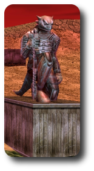
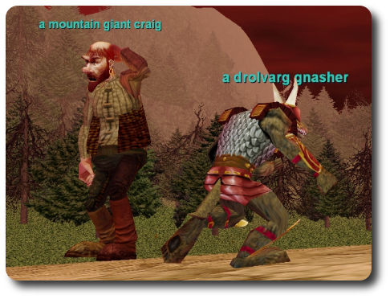
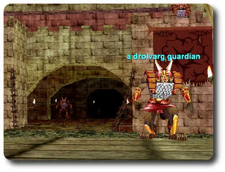
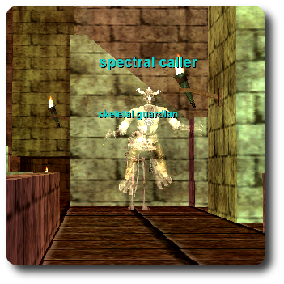
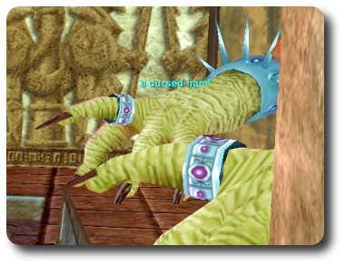

# EQ Nostalgia #2: Karnor's Castle

 One of the draws EQ2 has for all of us old EQ players is the nostalgia, especially for those of us who were there from the beginning. 

It's hard to overstate just the kind of impact Kunark had on us all. Never before and very rarely since had a company so completely matched an expansion to exactly what people wanted. All the good parts of EQ, they added more of. All the bad parts (like medding with your face in a book), they took away. Well, not ALL the bad parts. They had to leave some for Velious, after all.

Though I wasn't high enough level to go to the Dreadlands when Kunark came out, the stories I heard over guild chat were enough to chill my bones. Sneaking through a blasted landscape trying to watch all directions at once, madly dashing for safety from the drachnids and drolvargs. A omg DRAGON walking around, chasing the little lizards. Karnor's Castle and the World's Most Dangerous Zoneline.

Eh, what the heck. I went anyway. At 30. My urge to explore overcame my common sense. People were huddled against every wall, making sure the way to the nearest zoneline was clear.

And did Gorenaire see me? Yes, yes she did. Nobody could kill her yet, and I didn't see her. The first I knew she was in the area, I was being flung into the air and landed with just a sliver of life left. All the people in the area were running for the nearest zone. I followed the ones heading into the big building in the middle of the zone... the infamous Karnor's Castle.

It was CROWDED. Along with the people who fled Gorenaire, there was the pile of corpses at zone in, clerics offering buffs and rezzes for plat, groups at each side and one at the middle carefully pulling, people showing off their Sarnak Battleshields and other very cool loot.

SOE had figured out the EQ magic. Make lots of little camps, give people plenty of things to pull for good loot and experience, and not much downtime -- just enough so people could chat, relax, have a good time, play a game and have fun. EQ hadn't yet become anyone's second job. You found a zone your level, joined a camp, played until you got bored and someone would come take your place. Fifteen minutes, half an hour or all day if you liked, probably no game has ever made grouping as easy as EQ did with the Kunark expansion.

Later games (and even EQ itself in time) did away with camps and downtime. I think they took away some of the time to share stories, victories and just idle chatter that made friends and memories.

Hope you enjoyed this little romp around KC. We'll be there again in a couple of weeks, but old Venril has moved off to Old Sebilis (which will be my last little nostalgia post before the expansion) and the Drolvargs have finished taking over the place.

Poop everywhere.

