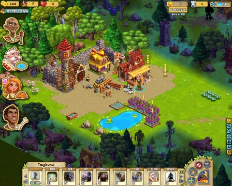
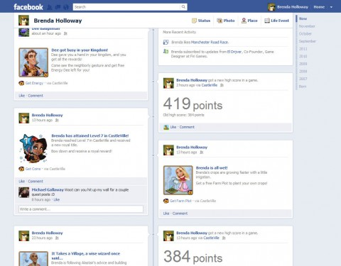
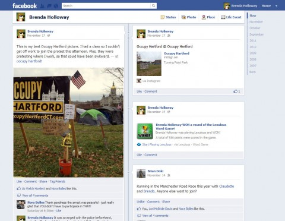

# How Castleville Lost Me.

*Posted by Tipa on 2011-11-22 22:23:36*

[caption id="attachment\_9865" align="aligncenter" width="480" caption="The Castleville board."][/caption]

With each new "-Ville" game, Zynga adds something new to their base clicker gameplay. Their latest, Castleville, adds fairly involved crafting to the farming mechanic from Farmville and the town building and creature fighting mechanic from Frontierville. Cityville's trading game and Empires & Allies rudimentary PvP are absent here.

The majority of the Castleville board is hidden beneath a "gloom" that can be dismissed via exploration, that can expose new resources and NPCs with which to expand your kingdom. The ever-helpful NPCs you meet will lead you through the game with quests, as in all the previous games.

I usually give Zynga games a couple months, but it's gone from my Facebook stream now. The picture below tells the story.

[caption id="attachment\_9867" align="aligncenter" width="480" caption="Castleville owns my timeline"][/caption]

Castleville friggin' took over my timeline. I post pictures to Facebook, chat with my family and non-G+ aware friends. When I look at my timeline to see at a glance what is happening, and all I see is Castleville... well, that can't happen.

This isn't the only annoying feature Castleville adds. Recent Zynga games have let you spam only your friends that are also playing the same game. Castleville does not give you this option. You can only select from a list of every friend in your list, or those who have played at least one game at some point (so, pretty much every friend on your list). You can't limit your spam to just Castleville friends, or just Zynga friends.

Castleville by itself isn't a bad game, and the crafting is innovative (though since it uses non- or very slow-renewing resources, you're forced to do most of your harvesting in your friends' kingdoms). You no longer need to click your harvests -- you can just wave your mouse over items to instantly collect them. I'd have liked to have seen that in Frontierville.

[caption id="attachment\_9866" align="aligncenter" width="480" caption="The timeline I wanted to see."][/caption]

I'd have liked to have played Castleville some more. But it's just too damn annoying and way too noisy. Thankfully, removing the app lets you have your timeline back.
