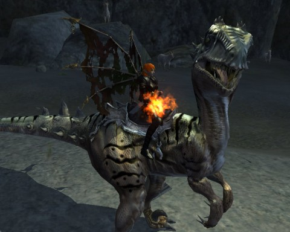
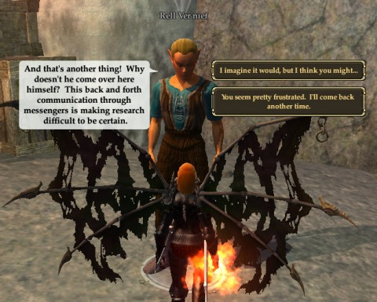

# EQ2: What, no SWTOR?

[caption id="attachment\_9882" align="aligncenter" width="480" caption="Rapture Raptor!"][/caption]

I do WANT to play Bioware's Star Wars: The Old Republic. I WILL play it. Just... not right now. I'm not in a good place with MMOs at the moment. See, I've just spent a month playing Skyrim, and it's left quite an impression. I just don't know if I can play a tightly scripted MMO when I've just spent 130 hours exploring a world.

There's just too much hype around the game right now. The hype makes it impossible for me to consider the title calmly, because, being the contrarian I am, I'd be inclined to hate it. It can't possibly live up to its hype, but why should that matter? Someday I'll sit down and watch all the Star Wars movies, or maybe play KotOR again, and then I know I'll want to play SWTOR. Or someone will want to form a static group -- because it doesn't even matter what game it is, meeting once a week for a static group is reason enough to play anything. My time in DDO proves that.

Anyway, EQ2 was my game tonight. I'd had to stop playing months ago when some sort of driver upgrade kept resetting my video card every minute or so, making the game unplayable. When EQ2 went F2P last week I deleted entirely all my old installations and made a new one from scratch -- and it worked wonderfully!

BUT... EQ2 F2P is not EQ2. It's some different beast. I was grandfathered in to a "Silver" account, but my characters were too far advanced in abilities and gear to use much of their stuff. I understood that EQ2 wasn't ever going to be playable entirely for free once past the very beginning levels, but I'd been hoping.

I couldn't get into my account details (for some reason) to check out my subscription plans. SOE customer service just tonight cleared that up. I got in game and blew the rest of my Station Cash on a one month gold subscription. 31 days to see what's happened to EQ2 since the last time I played. A long, long time ago.

[caption id="attachment\_9883" align="aligncenter" width="480" caption="Why do I need to carry messages back and forth?"][/caption]

All that time ago, I'd been working on the quest for the one "flying" mount available to a level 58 berserker, the leaper. This quest starts at a fossil dig in Butcherblock Mountains, and involves bringing a fossilized egg to life. There's so much back and forth couriering between two close NPCs that finally one of them lampshades the absurdity by wondering loudly why the OTHER NPC doesn't just COME OVER and talk to him!

The quickened egg is used to summon a fully grown "sailraptor" into Norrath, which instantly imprints and just begs to be jumped all over the zone. How could I possibly refuse? I could not.

The next mount, the glider, requires level 60. The flying mount requires level 85... but Fae, such as my dear Scatter, can actually gain true flight without needing a mount at all. So that's something cool.

I don't think I'm getting Scatter to 85 in 31 days, though. To be honest, I'm not even sure how I'd go about soloing a berserker. Fae are hardly the best race for it. I just rolled her up for fun when the race became available and never expected her to get out of her teens. Now look at her.

