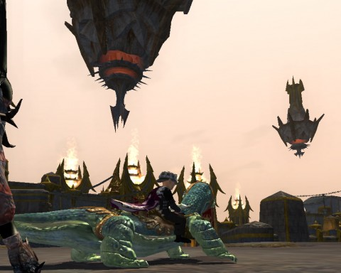
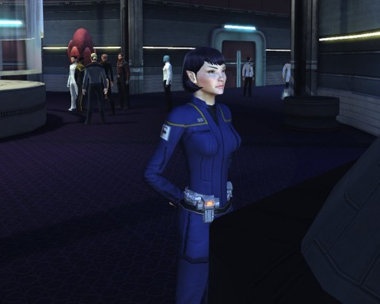
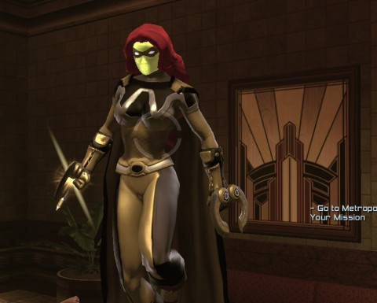

# EQ2, DCUO, STO: Things are starting to work again

[caption id="attachment\_9887" align="aligncenter" width="480" caption="New Freeport"][/caption]

I have a friend who is so into Rift. "You have to come back!" he said. "Ember Isles is amazing; the new warfront is awesome; the instant adventures are great!" I want to come back and see all this! Then he started playing SWTOR.

I really still want to come back. Problem is when I log in, I have to figure out all the new stuff; seems the soul trees change every time. I have to remember how to solo and how to group. I guess the penalties for getting it wrong aren't that high, and the new instant adventure thing could help get my feet wet quickly. I should check it out.

Tonight, though, after working on some Spotify playlists I wanted to get saved, my goal was to see how many MMOs I could get working again. Seems EQ2, STO and DCUO had all decided within a space of days to just give up and refuse to work.

EQ2 I got working via downloading it from scratch. I did the same with DCUO. Since I wanted to play EQ2 and DCUO was taking up my main account, I logged into my second EQ2 account, intending to take my 80 Inquisitor and do some Freeport exploring. Instead, I took my 71 necromancer out.

Her skills and gear weren't impacted at all by the silver account status; she just didn't have any amazing stuff. You don't focus on these things when you're still leveling, after all, as every spell, ability and piece of gear will just be replaced.

Anyway. Yesterday I couldn't continue on to the new gliding mount on my berserker, Scatter, as she's only 58 and 60 was needed. Nothing was holding Adora back; in fact with my vast selection of pets, none of the encounters were any trouble at all (granted, most of them were gray). Far sooner than it'd taken to get the leaper mount, I had the wind Komodo mount. It's... a little hard to control. I nearly glided right off the Kingdom of Sky, so I took the spires back down to the Commonlands and went to have a look at Freeport.

Aside from floating towers spinning slowly overhead everywhere you look, there's no zone lines any more! All four parts of Freeport and one zone now. The whole city looks like it was brought into sharp focus and saturated. Very pretty. The EQ2 character models have always been a little too realistic; now that extends to the architecture.

I still haven't \_done\_ anything in the game. There's a huge gap between futzing around looking at stuff and getting ready to group. The latter takes real commitment.

[caption id="attachment\_9889" align="aligncenter" width="480" caption="T'pral at the library computers"][/caption]

Someday, I'd like to be invited to Starfleet Academy to \_teach\_. But this time I came to learn -- about duty officers. I'd played with them a little bit on my main. There's a tantalizing little minigame involved. Various missions require various skills and temperaments. The better your duty officers match the requirements, the better the result.

I'd played with the duty officer system just before STO went free to play. After it went free to play, I couldn't log in any more. So... just as with EQ2, I deleted everything and downloaded everything again. And this time, I got right in. Weird.

I just plan to keep current on duty officer missions, at least with my Vulcan captain, until I figure out what I want to do in the game.

At least it works now, though.

[caption id="attachment\_9888" align="aligncenter" width="480" caption="Back in black! Er, yellow!"][/caption]

Couldn't get into DCUO past few days. I downloaded it anew day before yesterday and still no luck! Today, DCUO dropped a massive 5GB patch and afterward I could play just fine.

I didn't do anything. Just flew around and remembered I'd forgotten how to do anything else.

Next up: Rift and Wizard101. And then I'll have enough MMOs to keep me busy for awhile.
